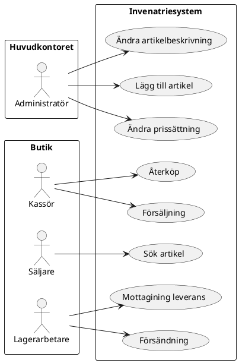
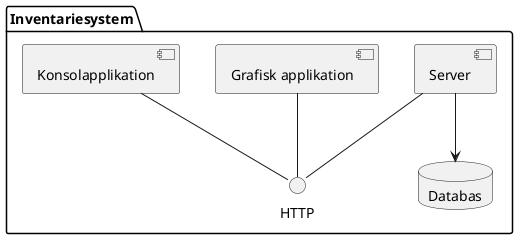
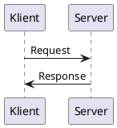

# Inlämningsuppgift 1 - Intentariesystem

## Översikt

En butikskedja inom hemelektronik behöver ett system för att hantera inventariet av varor i sina butiker. Inventariesystemets *use cases* (användningsscenarier) beskrivs av figuren nedan.



## Systembeskrivning

### Arbetsplats

Kedjans arbesplatser består av ett huvudkontor och ett stort antal butiker. Varje arbetsplats har ett unikt namn, en svensk adress, anställda och ett eget inventarie. 

### Anställda

Systemet användare är de anställlda på butikskedjan. Varje anställd med tillgång till systemet har någon av följande roller: 
- Kassörer
- Säljare
- Lagerarbetare
- Administratörer
  
Kassörer, säljare och lagerarbetare har en butik i kedjan som arbetsplats. Administratörer har huvudkontoret som arbetsplats. 

För varje anställd behöver systemet lagra:
- Anställningsnummer
- Roll inom företaget
- Arbetsplats
- Telefonnummer
- E-postadress
- Lösenord

En anställd loggar in i systemet genom sitt anställningsnummer och sitt hemliga lösenord.

### Artiklar

För alla artiklar behöver systemet lagra följande information:
- Artikelnamn (t.ex. "Samsung 43 TU8505 4K UHD Smart-TV")
- Artikelnummer (kedjans egna identitet för artikeln i inventariet)
- En bild av arikeln (i PNG-format)
- Aktuellt pris (i kr)
- Varumärke (t.ex. Samsung, Philips eller Sony)
- Modelnamn (t.ex. "UE43TU8505")
- Detaljerad beskrivning

Exempel på detaljerad beskrivning är:

<div style="font-style: italic; border: 1px solid black; margin: 1em; padding: 1em">
Upptäck dold skönhet i 4K-bildkvalitet med ett bredare färgspektrum, och hitta allt du letar efter enkelt och snabbt med Samsung 43 "TU8505 4K UHD Smart TV UE43TU8505.<br/>
  - 43" 4K UHD Smart-TV<br/>
  - Crystal Processor 4K, UHD Dimming<br/>
  - Tizen, bakgrundsläge, MultiView
</div>

För en specifik butik behöver systemet också kunna presentera artikelns lageralsaldo. 

Artiklarna som butikskedjan säljer faller in i någon av följande kategorier:

- Enheter
- Tillbehör

Enheterna består i sin tur av underkategorierna:
- TV-apparater
- Förstärkare

Tillbehör består av underkategorierna:
- Kablar
- Adaptrar

För alla enheter behöver systemet lagra:
- Dimension (höjd, bredd och djup i mm)
- Vikt (i gram)

För alla TV-apparater behöver systemet lagra:
- Upplösning på bilden (HD eller 4K)
- Paneltyp (LCD, OLED eller Plasma)

För alla förstärkare behöver systemet lagra:
- Effekt (i watt)

För alla kablar behöver systemet lagra:
- Längd (i mm)

### Systemkomponeter

Inventariesystemet består av tre komponenter:
- En central serverapplikation
- En grafisk klientapplikation
- En konolklientapplikation

Klienterna och servern skickar meddelanden till varandra över Internet via ett protokollet som heter HTTP.




### Meddelanden över HTTP

Klientapplikationerna skickar meddelanden till serverapplikationen över HTTP som kallas *anrop* (eng. *request*). Tillbaka för anropet får klientapplikationen ett meddelande som kallas *svar* (eng. *response*). 



Ett anropsmeddelande från klient till servern består av:
- IP-addressen för servern på Internet.
- Ett portnummer för anslutningen. 
- En metod som skall anropas på serverns resurs.
- En sökväg till en resurs på servern. 
- Huvudfält för anropet.
- En autentisering (användare och lösenord).

Ett svarsmeddelande från servern till ett anrop från  klientapplikation består av:
- En statuskod för behandlingen av anropet. 
- En motivation i text för statusen på behandlingen av anropet.


Både ett anrops- och svarsmeddelande kan också innehålla en kropp med information om format och kodning. 

#### IP-adresser 

Adressen för en dator på Internet kallas IP-adress. En IP-adress är en sträng som består av fyra tal mellan 0 och 255 separerade med punkter, t.ex. är  t.ex. ``"216.58.204.4"``. 

Som ett alias för en IP-adress kan också ett reserverat domännamn användas. T.ex. är domänen ``"www.google.com"`` ett alias för IP-adressen ``"216.58.204.4"``. 

Vissa IP-adresser har speciella användningsområden och kan inte användas på Internet. T.ex. är  ``127.0.0.1`` alltid IP-adressen för datorn som applikationen kör på och kan användas för att ansluta till andra applikationer på samma dator.

#### Portnummer

En applikation på en dator på Internet tar emot meddelanden på ett port som identifieras av för applikationen unikt 16-bitars heltal. Portnummer gör att det går att adressera meddelanden till olika applikationer på samma dator.

#### Metod

De metoder för HTTP-anrop som behövs för inventariesystemet är ``GET`` och ``POST``. Ett anrop med metoden ``GET`` förväntar sig ett svarsmeddelande där kroppen är en representation av resursern. Ett anrop med metoden ``POST`` har en kropp som skall skrivas till resursen och förväntar sig ofta ingen kropp i svarsmeddelandet. 

##### Resurssökväg

En resurssökväg är en sökväg till en resurs på servern, likt sökvägen till en fil på en hårddisk.

##### Kropp

Om ett HTTP-meddelande innehåller en kropp så består denna av en bytefält med binärdata tillsammans med information om formatet och kodningen av dokumentet. De två dokumentformaten som är aktuella för inventariesystemet är:

| Content-Type | Betydelse |
| --- | --- |
| ``"image/png"`` | Bild i PNG-format. |
| ``"application/xml; charset=UTF-8"`` | XML-dokument som text kodad med UTF-8. |  


### EasyServer

För att underlätta implementationen av server- och klientapplikationerna finns ett NuGet-paket ``EasyServer``. Paketet innehåller följande publika typer och gränssnitt:

```cs
using System.Collections.Generic;

namespace BitAddictAcademy
{
    namespace EasyServer
    {
        static public class Factory
        {
            static public IClient MakeClient();

            static public IServer MakeServer();
        }

        public struct MessageBody
        {
            string ContentType; 
            byte[] Data;
        }

        namespace Client
        {
            public struct Authentization
            {
                string UserName;
                string Password;
            }

            public interface IRequest
            {
                string ServerName;
                ushort Port;
                string Resource;
                Authentization Authentization;
                MessageBody? Body;
                Server.Response Response;
            }

            public interface IClient 
            {
                void SendRequest(IRequest request);
            }
        }

        namespace Server
        {
            delegate void RequestHandler(Client.IRequest request);

            public interface IResponse 
            {
                int Status;
                string Motivation;
                MessageBody? Body;
            }

            public interface IServer
            {
                event RequestHandler Request;
                void Start(int port);
                void ShutDown();
            }
        }
    }
}
```

#### Klientobjekt

En klient skapad med paketet har en metod ``SendRequest`` som tar ett anrop som argument och returnerar ett svar. Om metoden misslyckas att skicka meddelandet över Internet kastas ett exception av typen [```System.Net.HttpRequestException```](https://docs.microsoft.com/en-us/dotnet/api/system.net.http.httprequestexception?view=netcore-3.1). 

#### Serverobjekt

En server skapad med paketet har: 
- En metod ``Start(int)`` för att starta servern för att ta emot meddelande på porten som anges som argument. 
- En metod ``Shutdown()`` för att stänga ner servern. 
- Ett event ``Request`` för att hantering av anrop ankommande över Internet. 

Lyssnare till eventet ``Resuest`` får som argument ett objekt av typen ``IRequest`` med information om anropet. Om anropet kunde behandlas av lyssnaren så skall denna tilldela egenskapen ``Response`` i argumentet ett objekt motsvarande svarsmeddelandet med egenskaperna:
- ``Status`` och ``Motivation`` tilldelade ``200`` respektive "OK".
- ``Body`` tilldelad eventuell kropp för svarsmeddelandet. 

Om anropet inte kunde behandlas av lyssnaren tilldelas dess egenskap ``Response`` ett objekt motsvarande svarsmeddelandet med egenskaperna: 
- ``Status`` och ``Motivatino`` tilldelade enligt lämpligt typ av client error enligt specifikation på följande [sida](https://developer.mozilla.org/sv-SE/docs/Web/HTTP/Status).


### Inventariesystemets server

#### Resurser

Varje anrop till servern innehåller en sökväg till en resurs på servern. 

##### XML-anrop

Servern har en resurs med sökväg ``"/xml-request"`` som hanterar anrop med XML-meddelanden från klienterna. Denna resurs kan enbart anropas med metoden ``GET``. Rollen på användaren som krävs för att behandla anropet till denna resursen beror på XML-meddelandet. Om servern kunde behandla anropet har svarsmeddelandet alltid XML-meddelande som kropp.

##### Artikelbilder

Servern har också en resurs för varje artikelbild. T.ex. motsvarar sökvägen ``"/image/12345"`` bilden med har artikeln med artikelnummer ``12345``. Dessa resurser kan anropas både med metoden ``GET`` och ``POST`` för att hämta respektive tilldela bild för en artikel. Alla användare får hämta bilder men bara administratörer får tilldela artiklar nya bilder. 

För ett anrop med metoden ``GET`` ger servern ett svar med egenskaperna:
- ``Status`` och ``Motivation`` tilldelade ``200`` repspektive ``"OK"``.
- ``MimeType`` tilldelad ``"image/png"``.
- ``Body`` tilldelad en PNG-bild.

För ett anrop med metoden ``POST`` tilldelar servern artikeln PNG-bilden som utgör kroppen för anropsmeddelandet och ger ett svar med egenskaperna ``Status`` och ``Motivation`` tilldelade ``200`` repspektive ``"OK"``.
  
##### Felaktig resurssökväg

Ett anrop till någon annan resurs på server får ett svar med egenskaperna ``Status`` och ``Motivation`` tilldelade ``404`` respektive ``"Not Found"``.

#### XML-meddelanden


