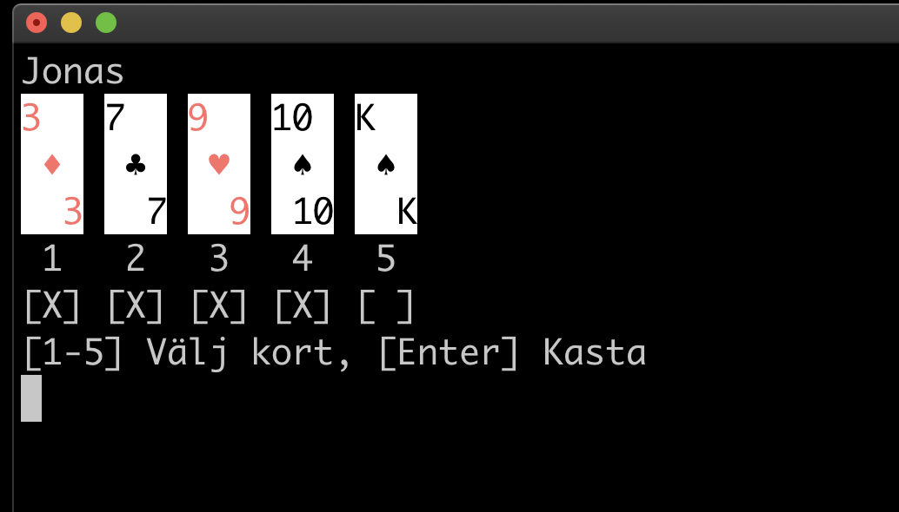

# Inlämningsuppgift 2 - Poker

## Översikt 

Uppgiften går ut på att färdigställa ett klassbibliotek för pokerspel. 

## Uppgiftsbeskrivning

För att lösa uppgiften skall ni forka följande [repo](https://github.com/jonaskeisu/Poker) på Github och skriva färdigt ett klassbibliotek för pokerspel. 

Repot består av en solution ``Poker`` innehållande två projekt: ett klassbibliotek ``PokerLib`` och en konsolapplikation ``PokerConsoleApp``. 

### PokerLib

Klassbiblioteket ```PokerLib``` skall implementera logiken för ett pokerspel. Biblioteket innehåller publika gränssnitt och typer, illustrerade av klassdiagrammet nedan. 

```plantuml 
left to right direction
enum Suite
{
    {static} Clubs
    {static} Diamonds
    {static} Hearts
    {static} Spades
}

enum Rank
{
    {static} Two = 2
    {static} Three
    {static} Four
    {static} Five
    {static} Six
    {static} Seven
    {static} Eight
    {static} Nine
    {static} Ten
    {static} Jack
    {static} Queen
    {static} King
    {static} Ace
}

enum HandType
{
    {static} HighCard
    {static} Pair
    {static} TwoPairs
    {static} ThreeOfAKind
    {static} Straight
    {static} Flush
    {static} FullHouse
    {static} FourOfAKind
    {static} StraightFlush
    {static} RoyalStraightFlush
}


interface ICard
{
    + Suite Suite
    + Rank Rank
}

ICard --* Rank
ICard --* Suite

interface IPlayer
{
    + string Name
    + ICard[] Hand
    + HandType HandType
    + int Wins
    + ICard[] Discard
}

IPlayer --o ICard
IPlayer --* HandType

interface IPokerGame
{
    IPlayer[] Players
    void RunGame()
    void SaveAndExit(string)
    void Exit()
    <<event>> NewDeal()
    <<event>> SelectCardsToDiscard(IPlayer)
    <<event>> RecievedReplacementCards(IPlayer)
    <<event>> ShowAllHands()
    <<event>> Winner(IPlayer)
    <<event>> Draw(IPlayer[])
}

IPokerGame --o IPlayer

class GameFactory
{
    {static} + IGame NewGame()
    {static} + IGame LoadGame(string)
}

GameFactory --> IPokerGame
```

Dessa gränssnitt och typer får inte modifieras med enda undantaget att att metoderna i klassen [Poker.Lib.GameFactory](https://github.com/jonaskeisu/Poker/blob/main/PokerLib/GameFactory.cs) behöver returnera objekt som implementerar gränssnittet [``Poker.Lib.IPokerGame``](https://github.com/jonaskeisu/Poker/blob/main/PokerLib/IPokerGame.cs). 


### PokerConsoleApp

Konsolapplikationen använder klassbiblioteket för att implementera ett pokerspel med konsolgränssnitt. 



Applikationen kan användas för för att testa klassbiblioteket och det ingår inte i uppgiften att göra några modififikationer i denna applikation. 


### Uppgiften

Uppgiften går ut på att färdigställa  ``PokerLib`` genom att utöka biblioteket med  interna typer och/eller gränssnitt. Innan ni börjar skriva kod skall ni utöka klassdiagrammet ovan med er objektorienterade design av klassbiblioteket och få detta diagram godkänt av läraren. Den slutgiltiga koden behöver dock inte stämma exakt överens med den presenterade designen.

## Poker

Det finns många varianter på poker. Ni skall implementera variant som beskrivs nedan.

### Korlek

Pokerspelet kräver en [fransk-engelsk kortlek](https://sv.wikipedia.org/wiki/Fransk-engelsk_kortlek) (utan jokerkort) med 52 kort och spelas av två till fem spelare. 

### Spelets gång

#### Ny giv

Varje giv i spelet börjar med att en dealer blandar kortleken och sedan delar ut kort från toppen på leken bordet runt till dess alla spelare har fem kort på handen. Korten delas ut med den anonyma baksidan uppåt så rank och färg är osynliga för samtliga spela. 

Efter given plockar varje spelare upp och inspektrar sin hand utan att visa kortens framsida åt de andra spelarna. De flesta spelare föredrar att sortera korten på handen i första hand efter rank och i andra hand efter färg för att enklare kunna tolka sin hand.

#### Byte av kort

Spelarna erbjuds sedan i turordning att slänga valfritt antal kort från hand och ersätts med lika många kort av dealern från toppen av leken, åter igen utan att visa några kort till övriga spelare. 

#### Showdown

Till sist visar samtliga spelare sin hand och spelaren med bäst hand vinner. Om en likvärdig bästa hand hålls av fler än en spelare så blir det lika och ingen spelare vinner.

#### Omstart

Efter showdown ger alla spelare ger sin hand till dealern som återför korten till leken tillsammans med alla kastade kort. Dealern blandar korten och spelet börjar om med nästa giv. 

Hela spelets gång illustreras av diagrammet nedan.

```plantuml
(*) --> "Dealern blandar kortleken"
--> "Dealern delar ut kort"
--> [Första spelaren] "Inspekterar sin hand"
--> "Kastar kort från handen"
--> "Får nya kort från dealern"
--> "Inspekterar sin hand igen"
if "Alla spelare har fått byta kort?"
    --> [NEJ (Nästa spelare)] "Inspekterar sin hand"
else 
endif
--> [JA] "Alla spelare visar sin hand"
if "En ensam spelare har bäst hand?"
    --> [JA] "Given har en vinnare"
    --> "Dealern samlar alla kort"
else 
    --> [NEJ] "Given är oavgjord"
endif
--> "Dealern samlar alla kort"
--> "Dealern blandar kortleken"
```

### Jämförelse av hand

De reglverket som skall användas för jämförelse av pokerhänder beskrivs [här](https://sv.wikipedia.org/wiki/Pokerhand). Regelverket skall följas exakt. 

## Tekniska krav på lösningen 

- När spelet avslutas kan användaren välja att spara spelarnas namn och antal vinster till en fil som sedan kan laddas nästa gång spelet startar upp. 

- Korten på hand för varje spelare skall vara sorterade i första hand från lägsta till högsta rank och i andra hand efter färg. 

