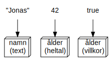
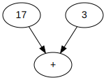
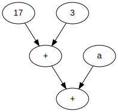
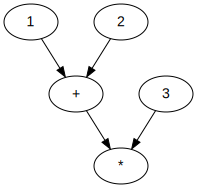
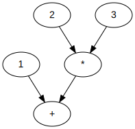

<div class="title-page">

# Variabler, typer och operatorer
</div>

---

## Syntax

***Syntax*** är formella regler för hur man skriver giltig kod.

---

## Variabler

- En ***variabel*** är ett lagringsutrymme i minnet för att lagra data
- Variabelns ***typ*** bestämmer tolkning, storlek och struktur på data
  - Data med en bestämd tolkning, t.ex. tal eller text, kallas även ***värde***
- I kod refereras en variabel via ett unikt namn som kallas ***identifierare***

---

### Exempel

Följande kod:

```cs
string namn = "Jonas";
int ålder = 42;
bool körkort = true;
```

skapar tre variabler och lagrar värden i dem, som illustrerat i figuren nedan.

<div style="display: flex; flex-direction: column; align-items: center; margin-top: 1em;">



</div>

---

## Identifierare

Syntax för en identifierare:

- är en sekvens av tecken
- sekvensen består endast av bokstäver, siffror eller ``_``
- måste börja med ``_`` eller en bokstav, inte en siffra

---

### Exempel

Giltiga identifierare:

  - ``length``, ``width``, ``color``, ``myName``, ``object1``, ``_variable``

Inte giltiga identifierare: 

  - ``1object``, ``my name``, ``object:1``

---

## Heltalstyper i C#

<center>
<table style="font-size: 80%; display: inline">
    <tr><th>Keyword</th><th>Möjliga värden</th><th>Data</th><th>.NET-typ</th></tr>
    <tr>
        <td><code>sbyte</code></td>
        <td>[-128, 127]</td>
        <td>8 bitar</td>
        <td><code>System.SByte</code></td>
    </tr>
    <tr>
        <td><code>byte</code></td>
        <td>[0, 255]</td>
        <td>8 bitar</td>
        <td><code>System.Byte</code></td>
    </tr>
    <tr>
        <td><code>short</code></td>
        <td>[-32 768, 32 767]</td>
        <td>16 bitar</td>
        <td><code>System.Int16</code></td>
    </tr>
    <tr>
        <td><code>ushort</code></td>
        <td>[0, 65'535]</td>
        <td>16 bitar</td>
        <td><code>System.UInt16</code></td>
    </tr>
    <tr>
        <td><code>int</code></td>
        <td>[-2 147 483 648, 2 147 483 647]</td>
        <td>32 bitar</td>
        <td><code>System.Int32</code></td>
    </tr>
    <tr>
        <td><code>uint</code></td>
        <td>[0, 4 294 967 295]</td>
        <td>32 bitar</td>
        <td><code>System.UInt32</code></td>
    </tr>
    <tr>
        <td><code>long</code></td>
        <td>[-9 223 372 036 854 775 808,<br/> 9 223 372 036 854 775 807] </td>
        <td>64 bitar</td>
        <td><code>System.Int64</code></td>
    </tr>
    <tr>
        <td><code>ulong</code></td>
        <td>[0, 18 446 744 073 709 551 615]</td>
        <td>64 bitar</td>
        <td><code>System.UInt64</code></td>
    </tr>
</table>
</center>

---

## Flyttalstyper i C#

<center>
<table style="font-size: 80%; display: inline">
    <tr><th>Keyword</th><th>Möjliga värden</th><th>Data</th><th>.NET-typ</th></tr>
    <tr>
        <td><code>float</code></td>
        <td>±1.5 x 10<sup>−45</sup> to ±3.4 x 10<sup>38</sup></td>
        <td>32 bitar</td>
        <td><code>System.Single</code></td>
    </tr>
    <tr>
        <td><code>double</code></td>
        <td>±5.0 × 10<sup>−324</sup> to ±1.7 × 10<sup>308</sup></td>
        <td>64 bitar</td>
        <td><code>System.Double</code></td>
    </tr>
    <tr>
        <td><code>decimal</code></td>
        <td>±1.0 x 10<sup>-28</sup> to ±7.9228 x 10<sup>28</sup></td>
        <td>128 bitar</td>
        <td><code>System.Decimal</code></td>
    </tr>
</table>
</center>

<br/>

*OBS: Vi kommer inte gå in på detaljer för typen* ``decimal`` *i denna kurs*

---

## Keyword

- Ett ***keyword*** är ett ord med speciell betydelse i programmeringspsråket.
- Keywords är inte giltiga identifierare. 

---

## Variabeldefinition

- Innan en variabel kan användas i koden så måste den *definieras*.
- Syntax för definition av en variabel:
    ``<typ> <identifierare>;``
- Identifieraren får inte redan vara definierad i samma block av kod.

---

### Exempel

```cs
byte shoeSize; // 1 byte allokerad
uint pixels; // 4 bytes allokerad
long credit; // 8 bytes allokerad
sbyte shoeSize; // FEL! redan definierad i kodblocket
int ulong; // FEL! ulong är ett keyword
int @ulong; // 4 bytes allokerade
```

*``//`` och efterföljande text på samma kodrad en kommentar i dokumenterande syfte och och påverkar inte programmets beteende*.

---

# Tilldelning

- Efter definition av en variabel är det möjligt att skriva till dess minne
- Att skriva till en variabels minne kallas att ***tilldela*** variabeln
- Syntaxen för tilldeling av en variabel är: 
    ``<variabel> = <uttryck>;``
- Uttrycket till höger i en tilldelning måste ha samma typ som variabeln

---

### Exempel

```cs 
int a;
int b; 
a = 1 + 2;
b = a * 3; 
```

---

## Variabelinitialisering

- En variabel kan tilldelas samtidigt som den definieras.
- Detta kallas ***initialisering*** av variabeln.
- En ej initialiserad variabel har standardvärdet för typen till den tilldelas.

---

### Exempel

```cs 
int a = 1 + 2;
int b = a * 3; 
```
---

## Implicit typning

- Om en variabel initialiseras kan typen ersättas med ``var``
- Variabeln får då automatiskt samma typ som initaliseringsuttrycket.
- Detta kallas att variabeln har ***implicit*** typ.

---

### Exempel

```cs 
var a = 1 + 2; // a har typen int
var b = 1.0 + 2.0; // b har typen double 
```

---

## Uttryck

- Ett ***utryck*** är kod som beräknas till ett värde 
- Exempel på enkla uttryck är:
  - Bokstavliga värden, så kallade ***litteraler***
    - T.ex. ``15``, ``123.456``, ``-189``
  - Variabler
    - T.ex. ``length``, ``x``, ``shoeSize``

---

## Heltalslitteraler

```cs
var a = 123; // int

var b = 123L; // long

var c = 123UL; // unsigned long

var d = 0x1AC3; // int på hexdecimal form

var e = 0b10101010; // int på binär form

var f = 0b_1010_1010; // samma betydelse som föregående rad

```

---

## Flyttalslitteraler

Flyttalslitteraler utmärker sig genom att de alltid innehåller en punkt.

```cs
var a = 123.0; // litteral av typen double

var b = 123.0f; // litteral av typen float

var c = 1.23e2; // litteral av typen double, scientific notation

var d = 1.23e2f; // litteral av typen float, scientific notation

var d = 1.23e-2f; // litteral av typen float, scientific notation
```

---

## Operatorer

- ***Operatorer*** skapar nya uttryck från andra uttryck
- Syntaxen för operatoruttryck använder sig av symboler, t.ex. ``+``, ``-`` och ``*``
- Uttrycken en operator beror på kallas för ***operander***

--- 

### Exempel 

I koden nedan:

```cs
int a = 17 + 3
```

används additionsoperatorn för att skapa ett uttryck, illustrerat av figuren nedan.


<div style="display: flex; flex-direction: column; align-items: center; margin-top: 1em;">



</div>

---

### Exempel 

I koden nedan:

```cs
int a = 10
int b = 17 + 3 + a
```

använder additionsoperatorn två gånger för att skapa två uttryck, varav ett är operand till det andra, som illustrerat av figuren nedan.


<div style="display: flex; flex-direction: column; align-items: center; margin-top: 0em;">



</div>

---

## Aritematiska operatorer

Följande operatorer finns för alla heltals- och flyttalstyper.

<center>
<table style="font-size: 75%; display: inline">
  <tr><th>Operator</th><th>Syntax</th><th>Resultat</th></tr>
  <tr><td>Addition</td><td><code>a + b</code></td><td>Summan av <code>a</code> och <code>b</code></td></tr>
  <tr><td>Subtraktion</td><td><code>a - b</code></td><td>Differenansen mellan <code>a</code> och <code>b</code></td></tr>
  <tr><td>Multiplikation</td><td><code>a * b</code></td><td>Produkten av <code>a</code> och <code>b</code></td></tr>
  <tr><td>Division</td><td><code>a / b</code></td><td>Kvoten av <code>a</code> och <code>b</code><br/></td></tr>
  <tr><td>Rest</td><td><code>a & b</code></td><td>Resten vid heltalsdivision  <code>a / b</code></td></tr>
  <tr><td>Negativ</td><td><code>-a</code></td><td>Minus <code>a</code></td></tr>
</table>
</center>
<br/>

OBS: ``a`` och ``b`` måste ha samma typ för att beräkningen skall kunna utföras och resultatet har samma typ som operanderna.

--- 

### Exempel

```cs
int a = 3;
int b = 2; 
double c = 3.0;
double d = 2.0;
var e = a + b; // int med värdet 5
var f = c + d; // double med värdet 5.0
var g = a / b; // int med värde 1 (heltalsdivision)
var h = a % b; // int med värde 1
var i = c / d; // double med värdet 1.5
var j = -c; // double med värdet -3.0
```

---

## Heltalsoperatorer

Följande operatorer finns endast för  heltalstyper.

<table style="font-size: 75%">
  <tr><th>Namn</th><th>Syntax</th><th>Resultat/sidoeffekt</th></tr>
  <tr><td>Prefix inkrement</td><td><code>++a</code></td><td>Öka värdet på <code>a</code> med 1 och ge sedan värdet på <code>a</code> som resultat</td></tr>
  <tr><td>Postfix inkrement</td><td><code>a++ </code></td><td>Ge värdet på <code>a</code>  som resultat och öka sedan värdet på <code>a</code> med 1</td></tr>
  <tr><td>Prefix dekrement</td><td><code>--a</code></td><td>Minska värdet på <code>a</code> med 1 och ge sedan värdet på <code>a</code> som resultat</td></tr>
  <tr><td>Postfix dekrement</td><td><code>a--</code></td><td>Ge värdet på <code>a</code>  som resultat och minska sedan värdet på <code>a</code> med 1</td></tr>
</table>

--- 

### Exempel

```cs
int a = 10;
int b = ++a; // b = 11, a = 11
int c = a++; // c = 11, a = 12
int d = --a; // d = 11, a = 11
int e = a--; // e = 11, a = 10 
```

---

## Sammansatt tilldelning

- Det är vanligt med tilldelningar på formen: ``x = x <operator> y;``

- Operatorerna för sammansatt tilldelning förenklar syntaxen

<center>
<table style="font-size: 75%; display: inline">
  <tr><th>Operator</th><th>Syntax</th><th>Betydelse</th></tr>
  <tr><td>Sammansatt addition</td><td><code>a +=  b</code></td><td><code>a = a + b</code></td></tr>
  <tr><td>Sammansatt subtraktions</td><td><code>a -=  b</code></td><td><code>a = a - b</code></td></tr>
  <tr><td>Sammansatt multiplikation</td><td><code>a *=  b</code></td><td><code>a = a * b</code></td></tr>
  <tr><td>Sammansatt division</td><td><code>a /=  b</code></td><td><code>a = a / b</code></td></tr>
</table>
</center>
<br/>

---

### Exempel

```cs
double a = 10.0;
a /= 2.0; // a = 5
a += 10.0; // a = 15
a -= 3.0; // a = 12
a *= 4.0; // a = 48
```

---

## Kedjor av operatorer

Har uttrycket tilldelat ``x`` i koden nedan:

```cs
int x = 1 + 2 * 3;
```

strukturen enligt bilden till höger eller vänster nedan?


<div style="display: flex; flex-direction: column; align-items: center">
<div style="display: flex;">
<div style="display: flex; flex-direction: column; align-items: center; margin-top: 0em;">



</div>

<div style="display: flex; flex-direction: column; align-items: center; margin-left: 3em;">



</div>
</div>
</div>

---

## Operatorföreträde

- Uttrycket ``1 + 2 * 3`` har strukturen enligt figuren nedan. 
- Anledningen är att det finns en [företrädesordning](https://docs.microsoft.com/en-us/cpp/c-language/precedence-and-order-of-evaluation?view=vs-2019) för operatorer.
- Multiplikation ligger högre i ordningen än addition och binder därför sina operander först.
- Operatorer på samma nivå binder operander enligt associativitet.
  - Vänster till höger eller höger till vänster. 

<div style="display: flex; flex-direction: column; align-items: center; margin-left: 3em; zoom: 0.8">


</div>

---

## Gruppering med parenteser

- Företrädesordningen kan kringgås genom gruppering med parentser. 
- Operatorer inom parenteser binder sina operander innan operatorerna utanför parenteserna.

---

### Exempel

Med parenterser har uttrycket tilldelat ``x`` i koden nedan: 

```cs
int x = (1 + 2) * 3;
```

nu strukturen enligt figuren nedan.

<div style="display: flex; flex-direction: column; align-items: center; margin-top: 0em;">


</div>

---

## Aritet

- En operators *aritet* är lika antal operander för operatorn
  - T.ex. har negativ aritet 1 och addition aritet 2 
- En operator med aritet 1 kallas ***unär***
- En operator med aritet 2 kallas ***binär***
- En operator med aritet 3 kallas ***trinär***

---

# Konvertering

- Konverteringsoperatorn konverterar ett värde av en typ till en annan typ
- Konverteringsoperatorn har följande syntax:

  ``(<typ>) <uttryck>``

  där ``<typ>`` är typen som uttrycket skall konverteras till.
- En lista över alla möjliga typkonverteringar finns [här](https://docs.microsoft.com/en-us/dotnet/csharp/language-reference/language-specification/conversions#explicit-conversions). 

--- 

### Exempel

```cs
int a = 123;
byte b = (byte)a; // konvertering till byte

double c = 123.456;
float d = (float)d; // konvertering till float
int e = (int)c; // konvertering till int, resultat: 123
```

---

## Implicit konvertering

- I vissa fall kan typer ***implicit*** konverteras till andra typer
- Taltyper implicit konverteras till "rymligare" taltyper
  - T.ex. kan ``float`` och ``int`` implicit konverteras till ``double``
- En fullständiga lista över implicita konverteringar finns [här](https://docs.microsoft.com/en-us/dotnet/csharp/language-reference/language-specification/conversions#implicit-conversions)

---

### Exempel

```cs 
var a = 1 + 2.0; // 1 konverteras implicit till double
double b = 123.456f; // implicit konvertering från float till double
float c = 123.456; // FEL! double kan inte implicit konvertersa till float
```

---

## Teckentyp

- Teckentypen i C# heter ``char``
- Lagrar ett tecken med UTF-16-kodning (2 bytes)
- Kan inte lagra surrogatpar 
- En teckenlitteral är tecknet inom apostrofer (``''``)
  - T.ex. ``'a'``, ``'Ä'``, ``'['``, ``'⻑'``, ``'β'``, 

---

### Exempel

```cs
char a = 'a'; 
uint b = a; // b = 0b_00000000_01100001, UTF-16-kod för tecknet 'a'
char c = '😊'; // FEL! Inte i första Unicode-planet, kräver surrogatpar 
```

---

## Texttyp

- Texttypen i C# heter ``string``
- En text är en sekvens av tecken
- Strängar kan lagra tecken utanför första Unicode-planet med surrogatpar
- En textlitteral är en teckensekvens inom enkla apostrofer (``''``)
  - T.ex. ``"Strängar kan innehålla emojis 😎"``
- Längden av en text ges av ``Length``-egenskapen

--- 

### Exempel

```cs
string text = "Hej!";
int length = text.Length; // length = 4
text = "🦊🐻🐼"; 
length = text.Length; // length = 6
```

---

## Strängoperatorer

Även strängar har operatorer.

<center>
<table style="font-size: 75%; display: inline">
  <tr><th>Operator</th><th>Syntax</th><th>Resultat</th></tr>
  <tr><td>Indexering</td><td><code>s [ i ]</code></td><td>Tecknet i strängen <code>s</code> med index <code>i</code></td></tr>
  <tr><td>Konkatenering</td><td><code>s1 + s2</code></td><td>Ny sträng bestående av <code>s1</code> följt av <code>s2</code></td></tr>

</table>
</center>

---

### Exempel

```cs
string text1 = "Hej";
string text2 = " då"; 
string text3 = text1 + text2; // text3 = "Hej då"
text3 += '!'; // text3 = "Hej då!"
char a = text1[0]; // a = 'H'
char b = text1[1]; // b = 'e'
char c = text1[2]; // c = 'j'
char e = text1[3]; // FEL! Strängen har inget element med index 3
```
---

## Escapesekvenser

- Kontrolltecken har ingen grafisk teckenrepesentation
  - T.ex. ``LF``, ``CR`` och ``BEL``
- Vissa tecken har speciell betydelse för sträng- eller teckenlitteraler
  - T.ex. ``"``, ``'`` och ``\``
- I litteraler måste sådana tecken uttrycks med ***escapesekvenser***

--- 

### Exempel 

Tabellen nedan beskriver de viktigaste escapesekvenserna. 

<center>

<table style="display: inline; font-size: 75%"">
  <tr><th>Escape-<br/>sekvens</th><th>Tecken</th><th>Betydelse</th></tr>
  <tr><td>\n</td><td><code>LF</code></td><td>Ny rad</td></tr>
  <tr><td>\r</td><td><code>CR</code></td><td>Gå till början av aktuell rad</td></tr>
  <tr><td>\t</td><td><code>HT</code></td><td> Horisontell tabulering</td></tr>
  <tr><td>\"</td><td><code>"</code></td><td/></tr>
  <tr><td>\'</td><td><code>'</code></td><td/></tr>
  <tr><td>\\</td><td><code>\</code><td><td/></tr>
</table>

</center>

En komplett förteckning av escapesekvenser finns [här](https://docs.microsoft.com/en-us/cpp/c-language/escape-sequences?view=vs-2019). 

---

### Exempel

Koden nedan:

```cs
Console.WriteLine("Hej\tdå!");
Console.WriteLine("Text på\nny rad.");
Console.WriteLine("Citat: \"text\"");
Console.WriteLine("C:\\Projekt\\hello-world\\Program.cs");
```
ger utskriften:

```text
Hej	   då!
Text på
ny rad.
Citat: "text"
C:\Projekt\hello-world\Program.cs
```

---

## Implicit konvertering till sträng

- De flesta typer kan implicit konverteras till ``string``

---

### Exempel

Koden nedan: 

```cs
double pris = 49.95;
double moms = 0.25; // 25%
Console.WriteLine(
  "Momsen på " + pris + " kr är " + 
  (moms * pris)  + " kr.");
```

ger utskriften:

```text
Momsen på 49.95 kr är 12.4875 kr.
```

--- 

## Stränginterpolation

- Text med värden av uttryck kan också skapas genom ***stränginterpolation***
- En interpolerad stränglitteral har prefixet ``$``
- Uttryck inom klammerparenteser (``{}``) utvärderas och konverteras till text

---

### Exempel

Koden nedan:

```cs
double pris = 49.04;
double moms = 0.25; // 25%
Console.WriteLine($"Momsen på {pris} kr är {moms * pris} kr.");
```

ger också uttskriften:

```text
Momsen på 49.05 kr är 12.4875 kr.
```

--- 

## Kontrollera antalet decimaler
 - ``{flyttal:0.##}`` i stränginterpolation ger två decimalers noggranhet
 - ``{flyttal:0.###}`` ger tre decimalers noggranhet osv

---

### Exempel

Koden nedan:

```cs
double pris = 49.04;
double moms = 0.25; // 25%
Console.WriteLine($"Momsen på {pris:0.##} kr är {moms * pris:0.##} kr.");
```

ger uttskriften:

```text
Momsen på 49.05 kr är 12.49 kr.
```

--- 

## Läsa text från användaren

- En textrad kan läsas in från användaren av en konsolapplikation med:

  ``Console.ReadLine()``

---

### Exempel

T.ex. en körning av koden nedan: 

```cs
Console.WriteLine("Skriv text.);
string text = Console.ReadLine();
Console.WriteLine($"Du skrev:\n{text});
```

se ut ut så här:

```text
Skriv in text.
Hej på dig!
Du skrev: 
Hej på dig!
```

--- 

## Konvertering av text till tal

Strängar kan konverteras till tal enligt tabellen nedan. 

<center>
<table style="font-size: 70%; display: inline">
  <tr><th>Syntax</th><th>Resultat</th></tr>
  <tr><td><code>SByte.Parse(s)</code></td><td>strängen <code>s</code> tolkad som <code>sbyte</code></td></tr>
  <tr><td><code>Byte.Parse(s)</code></td><td>strängen <code>s</code> tolkad som <code>byte</code></td></tr>
  <tr><td><code>Int16.Parse(s)</code></td><td>strängen <code>s</code> tolkad som <code>short</code></td></tr>
  <tr><td><code>UInt16.Parse(s)</code></td><td>strängen <code>s</code> tolkad som <code>ushort</code></td></tr>
  <tr><td><code>Int32.Parse(s)</code></td><td>strängen <code>s</code> tolkad som <code>int</code></td></tr>
  <tr><td><code>UInt32.Parse(s)</code></td><td>strängen <code>s</code> tolkad som <code>uint</code></td></tr>
  <tr><td><code>Single.Parse(s)</code></td><td>strängen <code>s</code> tolkad som <code>float</code></td></tr>
  <tr><td><code>Double.Parse(s)</code></td><td>strängen <code>s</code> tolkad som <code>double</code></td></tr>
</table>
</center>

---

### Exempel

```cs
double a = Double.Parse("123.456");
sbyte b = SByte.Parse("-17");
```


