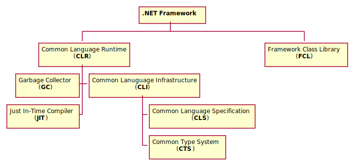

<div class="title-page">

# Introduktion till .NET
</div>

---

## Livscykel för traditionell applikation


<div class="center-image" style="zoom: 150%; margin-top: 1em">
    

    
</div>

---

## Plattform

- Operativsystem + Proccessor = Plattform, t.ex. 
  - Windows/x86-64 
  - Linux/ARM
- Traditionella applikationer kompileras för en specifik plattform

---

## Vad är .NET?

<div class="center-image" style="zoom: 140%; margin-top: 1em">
    

    
</div>

---

## Common Language Runtime

- En *virtuell* plattform implementerad i mjukvara
- Laddar och kör maskinkod som kallas ***Intermediate Languge***

---

## Intermediate Language

- Maskinkod för CLR som följer CLI
- Kallas också ***managed code***
- Oberoende av programmeringspråk

---

### Exempel

Koden för *Hello Wordl* nedan: 

<div style="zoom: 75%">

```cs
  class Program {
      static void Main(string[] args) {
          Console.WriteLine("Hello World!");
      }
  }
```

</div>

kompileras till följande IL-kod:

<div style="zoom:75%">

```cil
.method static void main()
{
    .entrypoint
    .maxstack 1

    ldstr "Hello world!"
    call void [mscorlib]System.Console::WriteLine(string)

    ret
}
```

</div>

---

## JIT-kompilatorn

- JIT-kompilatorn översätter efter behov IL till maskinkod för aktuell processor
- *Hello world* kompilerad till maskinkod för Intel x86-64 visas nedan: 

<div style="zoom: 75%">

```asm
global    _start

          section   .text
_start:   mov       rax, 1                  ; system call for write
          mov       rdi, 1                  ; file handle 1 is stdout
          mov       rsi, message            ; address of string to output
          mov       rdx, 13                 ; number of bytes
          syscall                           ; invoke operating system to do the write
          mov       rax, 60                 ; system call for exit
          xor       rdi, rdi                ; exit code 0
          syscall                           ; invoke operating system to exit

          section   .data
message:  db        "Hello, World", 10      ; note the newline at the end
```

</div>

---

## Framework Class Library

- Kodbibliotek med grundläggande funktionalitet för programmeringsspråk:
  - Grundläggande typer (``int``, ``double``, ``bool``, ..)
  - Samlingar (listor, uppslagstabeller, köer, ..)
  - I/O och tillgång till filsystemet
  - Säkerhet och användarrättigheter
  - Textkodnig och -manipulation
  - Felhantering
  - Flertrådad körning
  - .. 

---

## Garbage Collector

- Dynamiskt reserverat arbetsminne måste i vissa språk manuellt frigöras
- GC räknar ut vilket minne som inte används av applikationen längre
- Minne som inte används längre frigörs av GC automatiskt


---

## Livscykel för .NET-applikation

<div class="center-image" style="zoom: 140%; margin-top: 1em">
    

    
</div>

---

## .NET-programmeringsspråk

Kompilatorer till IL finns bl.a. för programmeringsspråken:
- C#
- F#
- C++
- Visual Basic
- Python
- Ruby

---

## Styrkan i .NET 

- .NET har potentialen att vara:
  - Oberoende av operativsystem och hårdvara
  - Oberoende av programmeringsspråk
- Resultet blir ökat användning av skriven koden

--- 

## .NET Framework

- ***.NET Framework*** var den första implementationen av .NET
- Första versionen släpptes 2002 tillsammans med C# av Microsoft
- Framgångsrikt koncept och många ramverk har tillkommit över åren
- .NET Framework-applikationer utvecklas främst med *Visual Studio 2019*

---

## Ramverk i .NET Frameworks

<center>
  <table class="frameworks" style="text-align: center; display: inline">
    <tr class="ver45"><td colspan="6">UWP</td>
    <td colspan="6">Task-based Async Model</td><td class="version">v4.5</td></tr>
    <tr class="ver40"><td colspan="6">Parallel LINQ</td>
    <td colspan="6">Task Parallel Library</td>
    <td class="version">v4.0</td></tr>
    <tr class="ver35"><td colspan="6">LINQ</td>
    <td colspan="6">Entity Framework</td>
    <td class="version">v3.5</td></tr>
    <tr class="ver30"><td colspan="3">WPF</td>
    <td colspan="3">WCF</td>
    <td colspan="3">WF</td>
    <td colspan="3">Card Space</td>
    <td class="version">v3.0</td></tr>
    <tr class="ver20" colspan="4"><td colspan="4">WinForms</td>
    <td colspan="4">ASP.NET</td>
    <td colspan="4">ADO .NET</td><td class="version" rowspan="3">v2.0</td></tr>
    <tr class="ver20"><td colspan="12">Framework Class Library</td></tr>
    <tr class="clr"><td colspan="12">Common Language Runtime</td></tr>
  </table>
</center>

---

## Vad gör ramverken?

- Exempel på syftet med ramverk i .NET Framework är:
  - Modeller för att bygga applikationer
  - Förenkla datahantering
  - Förenkla datorkommunikation
  - Förenkla flertrådad körning av kod

---

## Applikationsmodeller i .NET Framework

Exempel på applikationsmodeller i .NET Framework är:

- Konsolapplikationer
  - Console
- Webbapplikationer 
  - <nowiki>ASP.NET</nowiki> (*Active Server <nowiki>Pages.NET</nowiki>*)
- Grafiska desktopapplikationer: 
  - WinForms
  - WPF (*Windows Presentation Foundation*)
  - UWP (*Universal Windows Platform*)

---

## Brister med .NET Framework

- En version installerad på datorn för alla applikationer
  - Svårt att lägga till ny funktionalitet
- Nära knutet till Microsoft Windows

---

## Mono

- Open source-version av .NET Framework
- Första versionen släpptes 2004
- Kunde inte hålla jämna steg med .NET Framework
- Används fortfarande för nischade utveckling:
  - ***Xamarin*** / *Visual Studio 2019 for Mac*
    - Mobilapplikationer för Android och iOS
  - ***Unity***
    - Plattform och ramverk för spelutveckling

--- 

## .NET Core

- Ny open source-version av .NET från Microsoft
  - Rensad version av .NET Framework
  - Plattformsoberoende
  - Modulärt plattform
  - Kan distribueras med applikation
- Motsvarigheten till CLR i .NET Core heter *CoreCLR*
- Motsvarigheten till FCL i .NET Core heter *CoreFX*

---

## Visual Studio Code

- Plattformsoberoende utvecklingsmiljö för att passa med .NET Core
- Open source, lättviktig och modulär för att skapa stark community

---

## .NET Standard

- Med tre aktiva versioner av .NET i användning behövs en standard 
- .NET Standarden släpps med versionsnummer
- Xamarin och .NET Core följer .NET Standard 2.1
  - .NET Standard 2.1 krävs för C# 8.0
- .NET Framework följer .NET Standard 2.0
  - Kan av kompatibilitetsskäl aldrig lyftas till 2.1
- En specifik .NET Standard-version kan användas som *target* för assemblies

---

## Framtiden för .NET

- .NET Framework kan inte följa framtida versioner av .NET Standard
  - .NET Framework kommer stanna på major-version 4
- .NET Core är plattformen för den framtida utvecklingen av C# / .NET
- Nästa major-version av .NET Core kommer heta enbart *.NET 5*
  - Version 4 hoppas över för att undvika förväxling med .NET Framework

--- 

## NuGet

- NuGet är en pakethanterare för .NET-assemblies
- Vem som helst kan lägga upp assemblypaket i NuGet-arkivet
- Paketen innehåller information om:
  - Författaren 
  - Target framework, t.ex. en version av:
    -  .NET Core, .NET FW eller .NET Standard
  - Paketversion (*major*.*minor*.*patch*)
- NuGet kan användas för att automatiskt ladda ner rätt version av tredjepartsberoenden vid utveckling och distribution

 