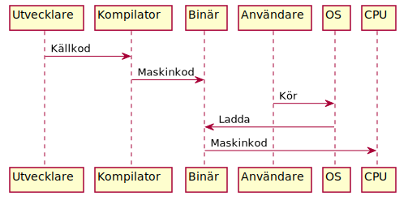
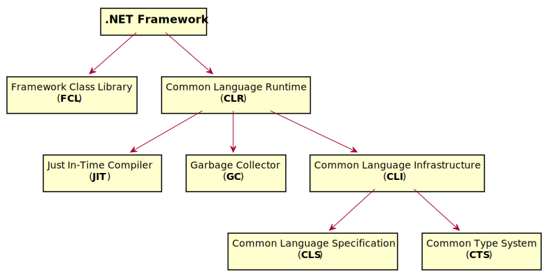
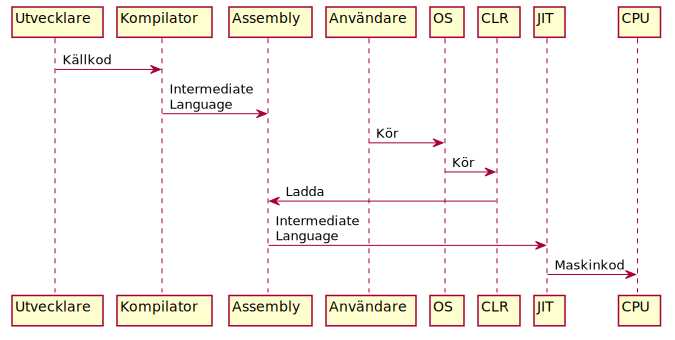

<div class="title-page">

# Introduktion till .NET
</div>

---

## Livscykel för traditionell applikation


<div class="center-image" style="zoom: 180%; margin-top: 0.5em">
    

    
</div>

---

## Binär

- En applikation eller ett kodbibliotek
- I Windows och .NET gäller att: 
  - Applikationer har filändelse ``.exe``
    - Står för *Executable*
  - Kodbibliotek har filändelse ``.dll`` 
    - Står för *Dynamic Link Library* 


---

## Plattform

- *Plattform = Operativsystem + Processorarkitektur*
- Exempel:
  - Windows/x86-64 
  - macOS/PowerPC
  - Linux/ARM
- En traditionell binär fungerar bara på en specifik plattform

---

## Vad är .NET?

<div class="center-image" style="zoom: 130%; margin-top: 1em">
    

    
</div>

---

## Common Language Runtime (CLR)

- *CLR* är en virtuell plattform implementerad i mjukvara

---

## Common Language Infrastructure (CLI)

- Beskrivning av en virtuell processor i CRL som innefattar: 
  - *CLS* - beskrivning av exekverbar maskinkoden
  - *CTS* - beskrivning av hur datatyper lagras i arbetsminnet
- Maskinkoden i .NET kallas för *Intermediate Language* (*IL*)

---

### Exempel

Koden för *Hello World* i C# nedan: 

<div style="zoom: 75%">

```cs
  class Program {
      static void Main(string[] args) {
          Console.WriteLine("Hello World!");
      }
  }
```

</div>

kan kompileras till följande IL-kod:

<div style="zoom:75%">

```cil
.method static void main() {
    .entrypoint
    .maxstack 1

    ldstr "Hello world!"
    call void [mscorlib]System.Console::WriteLine(string)

    ret
}
```

</div>

---

## Framework Class Library (FCL)

- Kodbibliotek med grundläggande funktionalitet för plattformen:
  - Grundläggande typer (``int``, ``double``, ``bool``, ..)
  - Samlingsdatatyper
  - I/O och tillgång till filsystemet
  - Säkerhet och användarrättigheter
  - Textkodnig och -manipulation
  - Felhantering
  - Flertrådad körning
  - .. 

---

## Just In-Time-kompilatorn

- *JIT* kompilerar IL till maskinkod för lokal processor
- Kompilering sker *Just-In-Time* dvs när IL-koden behöver köras
- Resulterande maskinkod körs sedan på lokal processor
- Resulterande maskinkoden lagras också i en lokal *cache* lokalt
  - .. så kompilering av IL-kod sker bara en gång.

---

### Exempel

Maskinkod för *Hello World* på Intel x86-64 kan se ut som följer:

<div style="zoom: 75%">

```asm
global    _start

          section   .text
_start:   mov       rax, 1                  ; system call for write
          mov       rdi, 1                  ; file handle 1 is stdout
          mov       rsi, message            ; address of string to output
          mov       rdx, 13                 ; number of bytes
          syscall                           ; invoke operating system to do the write
          mov       rax, 60                 ; system call for exit
          xor       rdi, rdi                ; exit code 0
          syscall                           ; invoke operating system to exit

          section   .data
message:  db        "Hello, World", 10      ; note the newline at the end
```

</div>

---

## Minnesallokering

- Kod kan allokerar (reserverar) arbetsminne från två källor:
  - *Stacken* - en förallokerad (*statiskt*) minnesarea för programmet
    - Här lagras värden för variabeler i koden
  - *Heapen* - dynamiskt allokerat minne
    - Här ligger minne för objekt som allokeras med nyckelordet ``new`` 
    - Även litteraler av typen ``string``
- Statiskt allokerat minne frigörs automatiskt
  - .. när variabeln går ur scope

---

## Garbage Collector (GC)

- Dynamiskt allokerat minne behöver frigöras när datat inte behövs längre
  - Traditionellt av programmeraren med nyckelordet ``delete``  
- Frigörs inte dynamiskt allokerat minne riskeras *minnesläckage*
- I .NET räknar *GC* ut vilket minne som inte används av applikationen längre
- Minne som inte används längre frigörs av GC automatiskt
- GC kör helta tiden med jämna intervall för att rensa heapen
  - När GC kör pausas ordinarie programkörning
  - Skapar slumpmässiga fördröjningar (*latens*) i programkörningen 
    - Gör .NET olämpliga för realtidsapplikationer


---

## Livscykel för .NET-applikation

<div class="center-image" style="zoom: 140%; margin-top: 1em">
    

    
</div>

---

## Fördelen med .NET

- Oberoende av operativsystem och hårdvara
  - Samma kod kan köras på Windows, Linux och macOS
- Kan användas för att utveckling för:
  - Desktop, server/molnet, webb och mobil
- Oberoende av programmeringsspråk

---

## .NET-programmeringsspråk

Följande språk kan kompileras till NET-assemblies:
- *C#, F#, C++/CLI, Visual Basic<span>.NET</span>, IronPython, IronRuby,* [m.fl.](https://en.wikipedia.org/wiki/Category:.NET_programming_languages)

--- 

## .NET Framework

- *.NET Framework* var den första implementationen av .NET
- Första versionen släpptes 2002 tillsammans med C# av Microsoft
- Applikationer utvecklas främst med *Visual Studio 2019*

---

## Ramverk i .NET Framework

<center>
  <table class="frameworks" style="text-align: center; display: inline">
    <tr class="ver45"><td colspan="6">UWP</td>
    <td colspan="6">Task-based Async Model</td><td class="version">v4.5</td></tr>
    <tr class="ver40"><td colspan="6">Parallel LINQ</td>
    <td colspan="6">Task Parallel Library</td>
    <td class="version">v4.0</td></tr>
    <tr class="ver35"><td colspan="6">LINQ</td>
    <td colspan="6">Entity Framework</td>
    <td class="version">v3.5</td></tr>
    <tr class="ver30"><td colspan="3">WPF</td>
    <td colspan="3">WCF</td>
    <td colspan="3">WF</td>
    <td colspan="3">Card Space</td>
    <td class="version">v3.0</td></tr>
    <tr class="ver20" colspan="4"><td colspan="4">WinForms</td>
    <td colspan="4">ASP.NET</td>
    <td colspan="4">ADO .NET</td><td class="version" rowspan="3">v2.0</td></tr>
    <tr class="ver20"><td colspan="12">Framework Class Library</td></tr>
    <tr class="clr"><td colspan="12">Common Language Runtime</td></tr>
  </table>
</center>

<div style="text-align: right">
    
(Källa: [wikipedia](https://en.wikipedia.org/wiki/.NET_Framework))
    
</div>
---

## Vad gör ramverken?

- Ramverken används t.ex. för att:
  - Modeller för att bygga applikationer
  - Förenkla datahantering
  - Förenkla datorkommunikation
  - Förenkla flertrådad körning av kod

---

## Applikationsmodeller i .NET Framework

Exempel på applikationsmodeller i .NET Framework är:

- Konsolapplikation 
- Webbapplikationer 
  - <nowiki>ASP.NET</nowiki> (*Active Server <nowiki>Pages.NET</nowiki>*)
- Grafiska desktopapplikationer: 
  - WinForms
  - WPF (*Windows Presentation Foundation*)
  - UWP (*Universal Windows Platform*)

---

## Brister med .NET Framework

- Samma installation används av alla applikationer på datorn
  - Svårt att uppdatera tekniken med så många beroenden
- Nära knutet till Microsoft Windows
  - Därför inte plattformsoberoende i praktiken

---

## Mono

- Open source-version av .NET Framework
- Första versionen släpptes 2004
- Lyckades inte hålla jämna steg med .NET Framework
- Används idag för nischad utveckling:
  - *Xamarin* - mobilapplikationer för Android och iOS
  - *Unity* - spel med 2D/3D-grafik.
- *Visual Studio 2019 for Mac* är en utvecklingsmiljö för Xamarin

--- 

## .NET Core

- Open source-version av .NET från Microsoft
  - Valda ramverken i .NET Framework
  - Plattformsoberoende
  - Modulärt design
    - All funktionalitet uppdelad i små paket
    - En applikation inkluderar bara det som behövs
  - Varje applikation kan ha egen version .NET 
- CRL => *CoreCLR*
- FCL => *CoreFX* 

---

## Visual Studio Code

- Plattformsoberoende utvecklingsmiljö för att passa med .NET Core
- Open source, lättviktig och modulär för att skapa stark community

---

## .NET Standard

- Med tre aktiva versioner av .NET finns behov av en standard:
  - .NET Standarden släpps med versionsnummer
  - Xamarin och .NET Core följer idag .NET Standard 2.1
  - .NET Framework följer .NET Standard 2.0
    - Kan av kompatibilitetsskäl aldrig lyftas till 2.1
  - .NET Standard 2.1 krävs för C# 8.0
- En specifik .NET Standard-version kan användas som *target* för assemblies

---

## Framtiden för .NET

- .NET Framework kan inte anpassas till nya versioner av .NET Standard
  - Kommer stanna på version 4
- .NET Core är plattformen för den framtida utvecklingen av C# .NET
- Nästa major-version av .NET Core kommer heta enbart *.NET 5*
  - Version 4 hoppas över för att undvika förväxling med .NET Framework

--- 

## NuGet

- NuGet är en pakethanterare för .NET-assemblies
- Vem som helst kan lägga upp paket med assemblies i NuGet-arkivet
- Utöver assemblies innehåller paketen information om:
  - Ansvarig utgivare
  - Target framework, t.ex. en version av:
    -  .NET Core, .NET Framework eller .NET Standard
  - Paketversion (*major*.*minor*.*patch*)
- NuGet hämtar automatiskt rätt version av paket som refereras i projektet

 