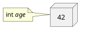
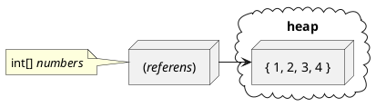
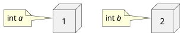
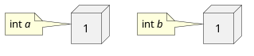
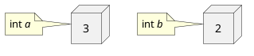
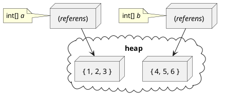
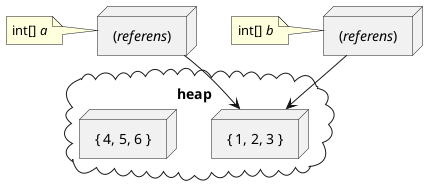

<div class="title-page">

# Fält och loopar
</div>

---

## Fält

- Ett *fält* (eng. *array*) är en sekvenser av element med konstant längd
- Elementen i ett fält är värden av *samma typ*

---

<div class="syntax">

## Definition av fältvariabel

En variabel som 

```text
<typ>[] <identifierare>;
```

### Betydelse
Identifieraren *&lt;identifierare>* är en ny variabel av typen referens till ett fält med element av typen *&lt;typ>*
</div>

---

## Exempel

```text
float[] testScores; // testScores är en ny referens till ett fält av floats

string[] employeeNames; // employeeNames är en ny referens till ett fält av strängar

bool[] boxesChecked; // boxesChecked är en ny referens till ett fält av booleans
```

---

# Konstruktion av nytt fält

- Ett nytt fält konstrueras med nyckelordet ``new``
- Vid konstruktion anges längden på fältet och typen på elementen 
- Ett fälts **längd** är antalet element i dess sekvens
- Längden på ett fält bestäms vid konstruktion och kan ej förändras

---

<div class="syntax">

## Konstruktion av nytt fält

### Syntax

```text
new <typ> [ <int> ]
```

### Betydelse

Uttryck för ett nytt fält med längd lika med värdet av ``<int>`` och element av typen ``<typ>`` som initieras till *default*-värdet.

</div>

---

## Exempel

```
int numberOfStudents = 25;

// konstruera ett nytt fält med 25 booleans initierade
// till default (false).

bool[] passedTest = new bool[numberOfStudents]; 
```

---

# Längden av ett fält

- Fält har en egenskap ``Length`` som är dess ***längd***
- Egenskaper för objekt uttrycks med *punktnotation*

---

<div class="syntax">

## Längden av ett fält

### Syntax

```text
<variabel>.Length
```

där ``<variabel>`` är en variabel av typen fält.

### Betydelse

Ett uttryck för antalet element i fältet ``<variabel>``.

</div>

---

## Exempel

```
int numberOfStudents = 25;

bool[] passedTest = new bool[numberOfStudents]; 

int length = passedTest.Length; // length tilldelas värdet 25
```

---

# Föränderligt vs. oföränderligt
  - Något som kan förändras kallas ***mutable***
  - Något som inte kan kan förändras kallas ***immutable***
  - Ett fälts längd är t.ex. *immutable*
  - En värdet på en variabel som inte är definierad som ``const`` är t.ex. *mutable* 

---

# Fältinitialiserare

- En ***fältinitaliserare*** (***array initializer***) används för tilldela ett nytt fälts element förutbestämda värden

---

<div class="syntax">

## Fältinitialiserare
### Syntax
```text
{ <elem 1>, <elem 2>, .., <elem k> }
```

där *&lt;elem 1>*, *&lt;elem 2>*, .., *&lt;elem&nbsp;k>* är uttryck av samma typ. 

### Betydelse
En sekvens av värden *&lt;elem&nbsp;1>*, *&lt;elem&nbsp;2>*, .., *&lt;elem&nbsp;k>*.
</div>

---

## Exempel

| Typ | Exempel på initialiserare | 
| :-: | --- | 
| ``double[]`` | `` { 46.5, 34.0, 36.0, 28.5 }`` | 
| ``string[]``| `` { "Anna Nylander", "Bo Ekfors" }`` | 
| ``bool[]`` | `` { false, true, true, false, true }`` | 

---

# Fältinialiserare är ej litteraler

- Fältinitialiserare kan *endast* användas för initiering av fält
- Följande är <span class="wrong">inte</span> giltig kod:

```text
int[] a; 
... 
a = {1, 2, 3}; // FEL! {1, 2, 3} är ej ett uttryck!
```

---

<div class="syntax">

## Initering av nytt fält
### Syntax
```text
new <typ> [] <fältinitialiserare>
```

där ``<fältinitialiserare>`` är en fältinitialiserare med element av typen ``<typ>``. 

### Betydelse
Referens till ett nytt fält med samma längd *k* och elementvärden som ``<fältlitteral>``.
</div>

---

## Exempel

| Fälttyp | Exempel på initieralisering | 
| :-: | --- | 
| ``double[]`` | ``new double[] { 46.5, 34.0, 36.0, 28.5}`` | 
| ``string[]``| ``new string[] { "Anna Nylander", "Bo Ekfors"}`` | 
| ``bool[]`` | ``new double[] { false, true, true, false, true }`` | 

*Notera att längden på fältet ej anges mellan hakparenterserna eftersom längden är implicit från antalet element i litteralen.*

---

# Implicit elementtyp

- Ett fälts elementyp är *implicit* från dess initialiserare om:
  - Ett element i initialiseraren har en typ sådan att för alla andra element:
     1. Elementet har samma typ, eller
     2. Implicit kan konverteras till typen.
- En implicit elementtyp kan utelämnas vid konstruktion av fält med ``new``

---

## Exempel

| Exempel på fältinitalisering | Implicit typ | 
| --- | :-: | 
| ``new [] { true, true, false, true, true }`` | ``bool[]`` | 
| ``new [] { 46.5, 34, 36, 28.5 }`` | ``double[]`` | 
| ``new [] { 123, 4294967296L, 34 }`` | ``long[]`` | 

---

# Initiering av fält vid variabeldefinition

Om en fältvariabel vid definition initeras till ett nytt fält med initialiserare och typen på elementet är angiven i variabelns typ så kan ``new <type>[]`` utelämnas i högerledet. 

---

## Exempel


Följande två satser har samma betydelse:
```text
double[] testScore = { 8, 16.5, 12, 17, 20, 11.5 };
```

```text
double[] testScore = new double[] { 8, 16.5, 12, 17, 20, 11.5 };
```

Följande två satser har också samma betydelse:

```text
string[] employeNames = { "Anna Nylander", "Bo Ekfors };
```

```text
string[] employeNames = new string[] { "Anna Nylander", "Bo Ekfors" };
```

---

# Indexiering

- ***Indexiering*** är ett uttryck för ett fälts element med ett specifikt index
- Ett indexerat element kan: 
  - användas som ett uttryck för elementets värde
  - tilldelas ett nytt värde

---

<div class="syntax">

## Indexiering av fält
### Syntax
```text
<variabel> [ <int> ]
```

där ``<variabel>`` är en fältvariabel och ``<int>`` är ett utryck av typen ``int``. 

### Betydelse
Elementet i fältet ``<variabel>`` med index lika med värdet av ``<int>``.
</div>

---

## Exempel 

```text
string[] array = { "Anna", "Jimmy", "Bo" };

string a = array[0]; // a tilldelas "Anna"
string b = array[1]; // b tilldelas "Jimmy"
string c = array[3]; // c tilldelas "Bo"

array[1] = "Karl"; // array innehåller nu { "Anna", "Karl", "Bo" }

// Följande rad ger FEL vid exekvering! (index out of bounds)
int d = array[3]; 
```

---

## Värdetyper

- Alla typer som diskuterats före fält är *värdetyper* (utom ``string``)
  - ``int``, ``double``, ``bool``, ``char``, ...
- En variabel av värdetyp ``T`` lagrar ett värde av typen ``T`` på stacken 

<center>



</center>

---

## Referenstyper

- Fältvariabler har inte värdetyp utan *referenstyp*
- En variabel av referenstyp ``T`` lagrar en referens till ett värde av typen ``T`` på stacken
- Det refererade värdet ligger i dynamiskt allokerat minne  i heapen

<center>



</center>

---

### Exempel

```cs 
int a = 1;
int b = 2;
```



```cs 
b = a;
```



```cs 
a = 3;
```



---

### Exempel

```cs 
int[] a = { 1, 2, 3 };
int[] b = { 4, 5, 6 };
```




```cs 
b = a;
```



```cs
a[1] = 7;
```


---

### Exempel

```cs 
int a = 1;
int b = 1; 
int[] c = {1, 2};
int[] d = {1, 2};
if (a == b)
    Console.WriteLine("a == b");
else
    Console.WriteLine("a != b");

if (c == d)
    Console.WriteLine("c == d");
else
    Console.WriteLine("c != d");
```

Utskrift:
```text
a == b
c != d
```
---

# Design vs. Implementation

 - Mjukvaruutveckling kan delas upp i två delar:
   - ***Design*** är att bestäm användarfunktioner och gränssnitt
   - ***Implementation*** är att skriva kod som uppfyller designen:
     - Bestämma hur data lagras
     - Skriv kod för funktionerna 
 - Tidigare under denna lektion har vi t.ex. beskrivit *designen* av fälttypen
 - Härnäst beskrivs fälttypens *implementation*

---

# Lagring av fält i minnet

- Ett fälts element lagras sekventiellt i minnet
- Alla element har samma typ och kräver lika många byte i minnet

---

## Exempel

<div style="display: flex; margin-top: 1em;">

<div style="margin-left: 1em;">

Elementen för fältet: 

```text 
int[] array = { 1, 2, 3 }
```

kan lagras i minnet med start på adress 1000 enligt tabell till höger med.

*Notera att*:
- Varje element lagras med 4 bytes
- Startadressen för elementet med index ``i`` alltid är ``1000 + i * 4``

</div>

<div style="zoom: 0.6; margin-left: 10em;">

<table>
  <tr> <th> Adress <th> Innehåll <th> Kommentar
  <tr> <td> 1000 <td> 00000001 <td rowspan="4"> array[0]
  <tr> <td> 1001 <td> 00000000 
  <tr> <td> 1002 <td> 00000000 
  <tr> <td> 1003 <td> 00000000 
  <tr> <td> 1004 <td> 00000010 <td rowspan="4"> array[1]
  <tr> <td> 1005 <td> 00000000 
  <tr> <td> 1006 <td> 00000000 
  <tr> <td> 1007 <td> 00000000 
  <tr> <td> 1008 <td> 00000011 <td rowspan="4"> array[2]
  <tr> <td> 1009 <td> 00000000 
  <tr> <td> 1010 <td> 00000000 
  <tr> <td> 1010 <td> 00000000 
</table>

</div>

</div>

--- 

# Implementation av fältindexiering

- För alla fält gäller att, om: 
  - ``start`` är startadressen för fältets första element i minnet, och 
  - ``size`` är antalet bytes för att lagra ett element
- .. så är startadressen för element med index ``i``:
  -  ``start + i * size``
- Därför kan ett program genom index och enkel aritmetik lika lätt läsa/skriva till minnet för vilket element som helst i fältet.

---

# Flerdimensionella fält

- Ett fält kan ha flera dimensioner
- Extra dimensioner separeras med komma mellan hakparenterserna
- Antalet dimensioner för ett fält kallas fältets ***rank***

---

<div class="syntax">

## Definition av flerdimentionell fältvariabel
### Syntax
```text
<typ>[ , , ..] <identifierare>;
```

### Betydelse
Identifieraren *&lt;identifierare>* är en ny variabel av typen referens till ett flerdimensionellt fält med element av typen *&lt;typ>* med rank lika med antalet kommatecken mellan hakparenteserna plus 1.
</div>

--- 

Exempel 

```text
int[,] firstArray; // firstArray är ett tvådimensionellt fält
int[,,,,] secondArray; // secondArray är ett femdimensionellt fält 
```

--- 

# Konstruktion av flerdimensionellt fält

- Ett nytt fledimensionellt fält konstrueras också med nyckelordet ``new``
- Flerdimensionella fält kan ha olika längd i varje dimension
- Totala antalet element är produkten av längden av samtliga dimensioner

--- 

# Exempel

```text
// 3 sekvenser av 4 booleans, alltså totalt 3 x 4 = 12 element 
bool[,] table = new bool[3, 4];

// 2 plan av 3 sekvenser av 6 heltal, alltså totalt  2 x 3 x 6 = 36 element
int[,,] tableSet = new int[2, 3, 6];
```
---

# Rank och längd på dimension

- Flerdimensionella fält har en: 
  - Egenskap ``Rank`` som är dess rank
  - Metod ``GetLength(int)`` som ger:
    - Fältets längd i en dimension med ett givet index
      - Dimensionerna indexieras med början på 0

---

<div class="syntax">

## Rank av ett fält

### Syntax

```text
<variabel>.Rank
```

där ``<variabel>`` är en variabel av typen fält.

### Betydelse

Ett uttryck för ranken av fältet ``<variabel>``.

</div>

---

<div class="syntax">

## Längd av ett flerdimensionellt fält

### Syntax

```text
<variabel>.GetLength( <int> )
```

där ``<variabel>`` är en variabel av typen fält .

### Betydelse

Ett uttryck för längden av fältet ``<variabel>`` i dimensionen med index lika med värdet av ``<int>``.

</div>

--- 

# Exempel

```text
int[,,] tableSet = new int[2, 3, 6];

int rank = tableSet.Rank; // rank tilldelas 3

int length0 = tableSet.GetLength(0); // length0 tilldelas 2
int length1 = tableSet.GetLength(1); // length1 tilldelas 3
int length2 = tableSet.GetLength(2); // length2 tilldelas 6

// Följande sats ger FEL vid exekvering! 
// Fältet tableSet har ingen fjärde dimension. 
int length3 = tableSet.GetLength(3); 
```

---


# Initering av flerdimensionella fält

- Flerdimensionella fält initeras med nästade fältinitierare
- ***Nästade*** betyder att objekt av samma sort ligger innuti varandra i flera lager
  - Exempel är lagren av en lök eller ryska babushka-dockor

---

# Exempel

<div style="zoom: 0.85">

```text
bool[,] table = new bool[3, 4] { 
  {true, false, true, false }, 
  {true, true, false, false }, 
  {false, false, true, true }
};

int[,,] tableSet = new int[2,3,6] {
  {
    {1, 2, 3, 4, 5, 6}, 
    {7, 8, 9, 10, 11, 12},
    {13, 14, 15, 16, 17, 18}
  }, 
  {
    {19, 20, 21, 22, 23, 24}, 
    {25, 26, 27, 28, 29, 30},
    {31, 32, 33, 34, 35, 36}
  } 
};
```
</div>

---

# Tillämpningar av flerdimensionella fält

- Tvådimensionella fält används för att lagra data med rektangulärt layout
  - T.ex. tabeller, bilder, shackbräde
- Tredimensionella fält används typiskt för att lagra:
  - Tidserier av tvådimensionella fält, t.ex. *video*
  - Skikt av tvådimensionella fält, t.ex. *skiktröntgen*, *minecraft-värld*
- Praktiska tillämpningar av fält med rank högre än tre är ovanliga

---

# Exempel

En animation med 25 bildrutor om 640 x 480 pixlar där varje pixel har en färgkod av typen ``int`` kan lagras i följande tredimensionella fält:

```text
int[,,] animation = new int[25, 480, 640];
```

Antag att färgkoden för grön är: ```0b00000000_11111111_00000000_00000000``` 
 
 Följande kod sätter då pixeln i rad 16 och kolumn 327 i bildruta 7 till färgen grön:

```text
const int green = 0b00000000_11111111_00000000_00000000;
animation[7, 16, 327] = green;
```

--- 

# Fält av fält

- Fält kan ha vilken elementtyp som helst
- Det är alltså möjligt att skapa fält av fält

---

## Exempel

```text
int[][] array1; // array1 är ett fält av int[]

double[][] array2; // array2 är ett fält av double[]
```

--- 

# Initering och indexering av fält av fält

```text
int[][] a = { new [] { 1, 2}, new [] { 3, 4, 5 } };
int b = a[0][1]; // b tilldelas 2 
int c = a[0][2]; // c tilldelas 5
int d = a[0][2]; // FEL vid exekvering! index out of bounds
```

---

# Fält av fält vs. tvådimensionella fält

- Skillnaden på ett fält av fält mot tvådimenssionella fält:
  - Fältet har rank 1, inte 2
  - Fälten i fältet kan ha olika längd
  - Fälten i fältet ligger inte sekventiellt i minnet
    - Indexiering i andra dimensionen involverar extra minnesläsning

---

<div class="title-page">

# Loopar

</div>

---

# Loopar

- Loopar används när kod behöver upprepas för en sekvens av data

---

# While-loop

- En while-loop är den enklaste typen av loop
- Upprepar en sats så länge ett villkor är uppfyllt
- Använder nyckelordet ``while`` 

---

<div class="syntax">

## While-sats

### Syntax
```text
while ( <villkor> )
  <sats>
```

där ``<villkor>`` är ett uttryck av typen ``bool``.

### Betydelse
Utvärdera ``<villkor>`` och exekvera sedan ``<sats>`` så länge som villkorets värde är *sant*. 

</div>

---

# Exempel

Skriv ut antalet 'a' i början på en sträng:

```text
text = "aaababcca";
int count = 0;
int index = 0; 

while (index < text.Length && text[index] == 'a') {
    ++count;
    ++index; 
}

Console.WriteLine(count);
```

---

# Do-while-loop

- En do-while-loop liknar en while-loop men exekverar
- Skillnaden är att den exekverar satsen först och testar villkoret efteråt
- Använder nyckelorden ``do`` och ``while``
- Används i praktiken betydligt mindre ofta än andra loopar

---

<div class="syntax">

## Do-while-sats

### Syntax
```text
do <sats>
while ( <villkor> );
```

där ``<villkor>`` är ett uttryck av typen ``bool``.

### Betydelse
Exekvera sats ``<sats>``, utvärdera ``<villkor>`` och upprepa så länge som villkorets värde är *sant*. 

</div>

---

## Exempel

Läs och summera tal från consolen så länge talet inte är negativt: 

```text
int sum = 0;
int number = 0;

do {
    sum += number; 
    number = int.Parse(Console.ReadLine());
} while (number >= 0);

Console.WriteLine($"sum: {sum}");
```

---

# Loop över fält

- Loopar används ofta för att processa element i fält

---

## Exempel

Summera alla tal i ett fält:

```text 
double[] data = { 1.2, 7.5, 3.8, 10.5 };
double sum = 0;

int index = 0; // Initiera indexvariabel
while(index < data.Length) { // stopvillkor
  // hantera aktuellt element
  sum += data[index]

  ++index; // stega index
}
```

---

## Ett till exempel

Hitta största talet på udda index i ett fält:

```text 
double[] data = { 1.2, 7.5, 3.8, 10.5, 5.3, 4.7, 0.2 };
double max = 0;

int index = 1; // Initiera indexvariabel
while(index < data.Length) { // stopvillkor
  // hantera aktuellt element
  if (data[index] > max) {
    max = data[index];
  }

  index += 2; // Stega index 
}
```

---

# Motivationen bakom for-loopen

- Det är mycket vanligt med loopar med strukturen:
  - Initiering av en indexvariabel till en startposition
  - Ett stopvillkor som säger om det finns fler element att behandla
  - Kod för att hantera elementet med aktuellt index
  - En sats som stegar indexvariabeln till nästa element
- Syftet med for-loopar är att:
  -  Tydliggöra att en loop har denna struktur
  -  Göra kod för loop med denna struktur mer kompakt
  -  Gör indexvariabeln tillgänglig endast under exkvering av loopen

--- 


<div class="syntax" style="zoom: 0.7">

## For-sats

### Syntax
```text
for ( <initering> ; <stopvillkor> ; <stegning> ) 
  <sats>
```

där ``<villkor>`` är ett uttryck av typen ``bool`` och ``<initering>`` och ``<stegning>`` är en enkel satser.

### Betydelse
Samma betydelse som: 
```text
{ 
  <initiering> ;
  while( <stopvillkor> ) {
    <sats>
    <stegning> ;
  }
}
```
</div>

---

## Exempel

Summera alla tal i ett fält:

```text 
double[] data = { 1.2, 7.5, 3.8, 10.5 };
double sum = 0;

for (int i = 0; i < data.Length; ++i) {
  sum += data[index]
}
```

---

## Ett till exempel

Hitta största talet på udda index i ett fält:

```text 
double[] data = { 1.2, 7.5, 3.8, 10.5, 5.3, 4.7, 0.2 };
double max = 0;

for (int i = 1; i < data.Length; i += 2)
  if (data[index] > max) {
    max = data[index];
  }
}
```

---

# Använd for-satsen på rätt sätt

- Använd enligt sitt syfte gör ``for``-satsen koden lätt att läsa
- En ``for``-sats som används på annat sätt gör koden missledande!
- Använd ``for``-satser endast i avsett syfte! 

