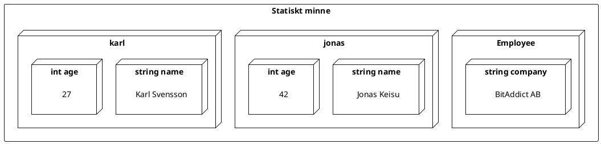

---
presentation:
  width: 1200
  height: 600
  theme: 'serif.css'
  center: false
  slideNumber: true
---
<style type="text/css">
  .reveal h1 {
    display: inline;
    text-align: center;
    display: flex;
    flex-direction: column;
    align-items: center;
  }
  .reveal p {
    text-align: left;
  }
  .reveal ul {
    display: block;
  }
  .reveal ol {
    display: block;
  }
  .reveal section {
    resize: false;
    width: 100%;
    height: 100;
    text-align: left;
   
  }
  .reveal pre {
    zoom: 110%;
  }
  div.slides{
     border: 1px solid black;
  }
  .reveal code {
    zoom: 90%;
  }
</style>


<!-- slide -->

# Sammansatta typer

<!-- slide -->

## Sammansatta typer

- Sammansatta typer beskriver konstruktioner av komponenter
- Exempel på sammansatta typer är:
  - En hammare är en konstruktion av ett huvud och ett handtag som kan användas för att slå ner spikar
  - En spelkort är består av en färg och en rank 
  - Ett bord är en konstruktion av en skiva och fyra ben som kan användas för att ställa föremål på
- Kallas också för *komposit*

<!-- slide -->

## Komposittyper i C#

- I C# finns två sorters komposittyper:
    - *Strukturer* - beskriver värdetyper
    - *Klasser* - beskriver referenstyper 
- Heltal, flyttal, tecken, bool och tupels är primitiva strukturtyper. 
- Strängar och fält är är primitiva klasstyper

<!-- slide -->

## Medlemmar

- I C# kallas delarna i en sammansatt typ för *medlemmar*
- Exempel på olika typer av medlemmar är:
  - Variabler
  - Funktioner
  - Operatorer
  - Nästade typer

<!-- slide -->

## Definition av struktur

En ny strukturtyp definieras med följande syntax:

```cs
<modifierare> struct <identifierare> 
{
    <modifierare> <medlem>
    <modifierare> <medlem>
    <modifierare> <medlem>
    ...
}
```

<!-- slide -->

## Instanser

- Värden tillhörande en sammansatt typ kallas också ofta *instanser*

<!-- slide -->

## Typdefinitionens dubbelnatur

- En sammansatt typ i C# är *två* saker samtidigt: 
  - En beskrivning av instanser av typen:
    - Ingående element
    - Hur de kan konstrueras och initialiseras 
    - Vilka operationer som är tillåtna på dem
  - En komposit med egna medlemmar

<!-- slide -->

## Static

- Modifieraren ``static`` betyder att en medlem tillhör typen
- Utan modifieraren ``static`` tillhör medlemmen insatser av typen

<!-- slide -->

## Punktoperatorn

Punktoperatorn refererar medlemmar i kompositer med syntaxen:

```cs
<komposit> . <medlem>
``` 

där ``<komposit>`` kan vara en typ, en instans eller ett namespace.

<!-- slide -->

### Exempel

```cs
struct MyStruct {
    static public int x; // Typvariabel
    public int y; // Instansvariabel
}
```

```cs
MyStruct.x = 1; // Korrekt
MyStruct.y = 2; // Kompileringsfel! Typen har ingen medlem y

MyStruct a;
a.y = 2; // Korrekt
a.x = 1; // Kompileringsfel! Instansen har ingen medlem x
```

<!-- slide -->

### Exempel

- Den primitiva strukturtypen ``int`` har:
  - En *typmedlem* ``int Parse(string s)``, och
  - En *instansmedlem* ``string ToString()`` 

```cs
int a = int.Parse("123"); // Anrop av typmedlem
string s = a.ToString(); // Anrop av instansmedlem
```

<!-- slide -->

### Exempel

```cs
static class Program 
{
    // Definition av typen Employee
    struct Employee {
        static public string company;
        public string name; 
        public int age; 
    }
... 
```

<!-- slide -->

```cs
    ...

    static public void Main(string[] args) {
        // Tilldelning av typvariabel
        Employee.company = "BitAddict AB";
        // Konstruktion av två instanser av Person
        Person jonas;
        Person karl; 
        // Tilldelning av instansvariabeler
        jonas.name = "Jonas Keisu"; 
        jonas.age = 42;
        karl.name = "Karl Svensson"; 
        karl.age = 27; 
    }
}
```

<!-- slide -->

Figuren nedan illustrerar datat lagrat i minne.

<br/>

<center>



</center>

<!-- slide -->

## Namespace 

- Ett *namespace* är namngivna nästbara samling av typer
- Alla typer måste tillhöra ett namespace
- En typ är synlig:
  - I namespacet där den är definierad, och
  - Underliggande namespace
- På alla andra ställen måste typen refereras via sitt namespace

<!-- slide -->

### Exempel

```cs
namespace A {
    struct TA { B.TB x; B.C.TC y; D.TD z; }
    namespace B {
            struct TB { TA x; C.TC y; D.TD z; }
            namespace C {
                struct TC { TA x; TB y; D.TD z; }
            }
    }
}
namespace D {
    struct TD { A.TA x; A.B.TB y; A.B.C.TC z; } 
}
```

<!-- slide -->

## Åtkomst

- Åtkomstmodifierare anger vem som har tillgång till en medlem
- Exempel är:
  - ``private`` - bara andra medlemmar i samma typ
    - default för medlemmar
  - ``internal`` - typer i samma assembly
    - default för typdefinitioner
  - ``public`` - vem som helst
- *Åtkomst skall vara så begränsad som möjligt*

<!-- slide -->

## Metoder

- En medlemsfunktion kallas *metod*
- Nyckelorder ``this`` refererar instansvärdet i metodens kropp
  - Kan användas för att kvalificera identifierare

<!-- slide -->

### Exempel

```cs 
namespace TicTacToe {
    enum Marker { Blank, Cross, Circle }
    struct Board {
        static int width = 3, height = 3;
        Marker[] markers;
        public void Initialize() {
          // Notera: instansmedlemmar kan referera typmedlemmar
          markers = new Marker[width * height];
          for (int i = 0; i < markers.Length; ++i)
            marker[i] = Marker.Blank;
        } 
    }
}
```

<!-- slide -->

### Exempel

```cs
... 
    struct Board {
        static int width = 3, height = 3;
        Marker[] markers;

        static public void Initialize() {
          // FEL! Typmedlemmar kan INTE referera instansmedlemmar
          markers = new Markers[width * height]; 
          ... 
        }
... 
```

<!-- slide -->

## Initialisering av strukturer

- Default för strukturer är att alla medlemsvariabler initialiseras till defaultvärdet för den egna typen

<!-- slide -->

### Exempel

```cs 
struct Employee {
  int age;
  string name;
  bool driversLicense;
}
```

```cs 
Employee jonas;
// jonas.age = 0
// jonas.name = null 
// jonas.driversLicense = false
```

<!-- slide -->

## Konstruerare 

- En *konstruerare* är en metod som initialiserar en ny instans
- För konstruerare gäller att:
  - De har modifieraren ``public``
  - De har ingen returtyp (inte ens ``void``)
  - De heter exakt samma som typen
  - Måste ta argument för en struktur
  - Anropas med nyckelordet ``new``

<!-- slide -->

### Exempel

```cs
struct Board {
  Marker[] markers;
  public Board(int width, int height) {
    markers = new markers[width * height];
    for (int i = 0; i < markers.Length; ++i) {
      markers[i] = Marker.Blank;
    }
  }
}
```

```cs
Board b = new Board(width, height);
```

<!-- slide -->

### Initalisere för komposittyper

En initialiserare för en komposittyp har syntax: 

```cs
{ <medlem> = <värde>, <medlem = <värde>, ... }
```

där varje medlem är en variabel eller en egenskap. 

Eventuell initaliserare kommer direkt efter konstruktoranrop:

```cs
<typ> <identifierare> = new <typ>( <argumentlista> ) <initialiserare> ;
```

<!-- slide -->

### Exempel

```cs 
 struct Employee {
   public string name;
   public int age; 
   public bool driversLicense;
 } 
 ```

 ```cs
 Employee jonas = new Employee() {
   name = "Jonas Keisu",
   age = 42, 
   driversLicense = true
 };
 Employee karl = new Employee { name = "Karl Svensson", age = 27 };
```

<!-- slide -->

## Typkonstruerare

- En komposittyp kan ha en *typkonstruerare*
- Används vid behov för att initiera typmedlemmar
- För en typkonstruerare gäller att den:
  - Har modifieraren ``static``
  - Har ingen returtyp (inte ens ``void``)
  - Heter exakt samma som typen
  - Tar inga argument
  - Körs när typen laddas av runtimen

<!-- slide -->

### Exempel

```cs
namespace TicTacToe {
  struct Board {
    static int width;
    static int height; 
    Marker[] markers; 

    static Board() {
      width = 3;
      height = 3;
    }
    ...
```

<!-- slide -->

### Överlagring av indexoperatorn

Indexoperatorn kan överlagras för en komposittyp enligt följande:

```cs
( struct | class ) <typ> {
  ...
  public <elementtyp> this[<indextyp> key1, <indextyp> key2, ...] {
    get {
      // kod som returnerar indexierat element
    }
    set {
      // kod som tilldelar indexierat element från value
    }
  }
...
```

<!-- slide -->

### Exempel

```cs
namespace TicTacToe {
  struct Board {
    Marker[] markers;
    public Marker this[int i] {
      get { return markers[i]; }
      set { markers[i] = value; }
    }
    public Marker this[int row, int col] {
      get => markers[row * 3 + col];
      set => markers[row * 3 + col] = value;
    }
  }
  ...
```

<!-- slide -->

```cs
Board board = new Board(3, 3);
board[2, 1] = Marker.Circle; 
...
if (board[1, 1] == Marker.Blank) {
  ...
}
```

<!-- slide -->

## Operatoröverlagring

Operatorer kan överlagras för komposittyper på följande sätt:

```cs
( struct | class ) <typ> {
  public static <typ> operator <symbol>(<typ> op1, ..) {
    // kod som skapar och returnerar resultatet
  }
}
```

där minst en operand måste ha samma typ som typen där operatorn är definierad. 

<!-- slide -->

## Exempel

```cs 
struct Fraction { // bråktal
  int n; // täljare 
  int d; // nämnare
  public Fraction(int n, int d) { this.n = n; this.d = d; }
  public static Fraction operator -(Fraction a) { 
    return new Fraction(-a.n, a.d);
  }
  public static Fraction operator +(Fraction a, Fraction b) =>
    new Fraction(a.n * b.d + a.d * b.n, a.d * b.d);
  public static Fraction operator *(Fraction a, int b) =>
    new Fraction(a.n * b, a.d);
}
```

<!-- slide -->

```cs 
Fract a = new Fract(4, 5) * 2; // a.n = 8, a.d = 10
Fract b = new Fract(1, 3);
Fract c = a + b; // c.n = 17, c.d = 15
c *= 10; // c.n = 170, c.d = 15
Fract d = -c; // d.n = -170, d.d = 15
```

<!-- slide -->

## Överlagring av konvertering

Konvertering kan överlagras för en komposittyp enligt nedan: 

```cs
( struct | class ) <typ> {
  ...
  public static implicit operator <tilltyp>(<fråntyp> x) {
    // kod som returnerar resultatet
  } 
  ...
  public static explicit operator <tilltyp>(<fråntyp> x) {
    // kod som returnerar resultatet
  }
```

<!-- slide -->

### Exempel

```cs 
struct Fraction { // bråktal
  ...
  public static implicit operator Fraction(int x) => 
    new Fraction(x, 1);
  public static explicit operator Fraction(double x) {
    if (x == 0 || x >= 1000) 
      return (int)Math.Round(x);
    else {
      int den = (int)Math.Pow(10, 
        Math.Floor((Math.Log10(Math.Abs(x)))) + 3);
      return new Fraction((int)Math.Round(x * den), den);
    }
  }
```

<!-- slide -->

```cs
Fract a = 1000; // a.n = 1000, a.d = 1;
Fract b = (Fract)3.14159265359; // b.n = 3142, b.d = 1000
```

<!-- slide -->

## Egenskaper

- En egenskap är ett attribut (adjektiv) som beskriver en komposit
- Exempel på egenskaper är:
  - Vikt, längd, färg, kodning, namn, ...
- Värdet på egenskapen kan läsas och/eller skrivas.
- Egenskaper beskrivs med *accessormetoder*

<!-- slide -->

## Exempel


```cs
namespace TicTacToe {
  struct Board {
    private int w, h;
    private Marker[] markers;
    public Board(int width, int height) { w = width; h = height; Init(); }
    private void Init() { 
      markers = new Marker[w * h];
      for (int i = 0; i < w * h; ++i) markers[0] = Marker.Blank;
    }
    ...
```


<!-- slide -->

```cs
namespace TicTacToe {
  struct Board {
    ...
    public int GetWidth() => w;
    public int SetWidth(int value) {
      if (value >= 0) { w = value; Init(); }
    }

    public int GetHeight() => h;
    public int SetHeight(int value) {
      if (value >= 0) { h = value; Init(); }
    }
  }
}
```

<!-- slide -->

## Accessormetoder

- I C# finns speciell syntax för att beskriva accessormetoder:

```cs
( struct | class ) <typ> {
  <modifierare> <typ> <egenskap> {
    get {
      // kod som returnerar värdet på egenskapen
    }
    set {
      // kod som sätter värdet på egenskapen till value
    }
  }
}
```

<!-- slide -->

```cs
namespace TicTacToe {
  struct Board {
    ...
    public int Width {
      get => w;
      set { if (value >= 0) { w = value; Init(); } }
    }
    public int Height {
      get => h;
      set { if (value >= 0) { h = value; Init(); } }
    }
  }
}
```

<!-- slide -->

```cs
Board board = new Board { Width = 3, Height = 3 };
board.Width = 4;
board.Height = 5;
```

<!-- slide -->

## Tillämpningar av egenskaper

- Skydda åtkomsten till medlemsvariabler
- Beskriva logiska egenskaper som inte har en direkt representation i form av medlemsvariabler

<!-- slide -->

### Exempel

```cs
namespace TicTacToe {
  struct Board {
    ...
    public bool Full {
      get {
        for (int r = 0; r < Height; ++r)
          for (int c = 0; c < Width; ++c)
            if (markers[r * Width + c] == Marker.Blank)
              return false;
        return true;
      }
    } 
    ...
```

<!-- slide -->

```cs
Board board = new Board(3, 3);
// kod som förändrar markörerna på brädet
...
if (board.Full) {
  Console.WriteLine("Spelet är slut, det blev lika.");
  ...
}
```

<!-- slide -->

## Mer om consolen

- Genomgång av standard in och standard ut från terminalen.

