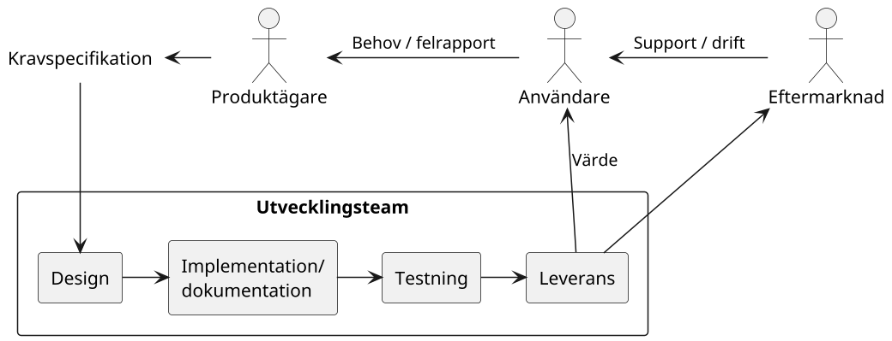

---
presentation:
  width: 1200
  height: 600
  theme: 'serif.css'
  center: false
  slideNumber: true
---

<!-- slide -->

# Introduktion till systemutveckling

<!-- slide -->

## Vad är systemutveckling?

"Processen att kravställa, designa, implementera och testa nya mjukvaruapplikationer."

<!-- slide -->

### Aktiviteter inom systemutveckling

<!-- slide -->

## Exempel på användarbehov

### Privatpersoner

- Sökning
- Kommunikation
- Underhållning
- Produktivitet
- Kreativitet
- ...

### Buiness-to-business

- Databehandling
- Beräkning och analys
- Marknadsföring
- Integration
- Infrastruktur
- ...

<!-- slide -->

## Skillnaden på behov och krav

- Behov är önskemål på resultatet från slutanvändaren
- Krav är en specifikation på resultatet från beställaren
  - Vilka behov skall tillfredställas och på vilket sätt
  - Tekniska krav
- Ett behov som täcks av kraven ingår i projektets omfattning

<!-- slide -->

## Exempel på krav

- Funktion
- Budget
- Användargränssnitt
- Bakåtkompatibilitet
- Presetanda

 

- Integration
- Kodstandard
- Plattform

<!-- slide -->

## Vad är design?

"Design är att skapa att ritning av ett föremål före produktion." 

<!-- slide -->

### Vad ingår i en "ritning" för mjukvara?

- Beslut om mjukvarans utformning som inte täcks av kravspeficikationen och förutsättningarna, kan vara t.ex. 
  - Användargränssnittet utseende
  - Val av applikationsramverk
  - Systemkomponenter
  - Kommunikationsgränssnitt

<!-- slide -->

## Vad är implementation?

Uppfyll krav och design genom att skriva: 
- Kod för funktionalitet
- Automatiserade tester
- Dokumentation

<!-- slide -->

## Verktyg för implementation

- Integrated Development Environment
- Ramverk för automatiserad testning
- Continiuous Integration-server

<!-- slide -->

## Utvecklingsprocess

- Hur skall utvecklingsteamet kommunicera (internt/externt)
- Hur schemaläggs arbetsuppgifter 
- Vad är kriterierna för att en arbetsuppgift är löst
- Kodningsstandard
- Krav på dokumentation
- Testningsstrategi
- Konventioner för versionshantering av kod
- Rapportering och hantering av avvikelser i mjukvaran 

<!-- slide -->

## Best practices

Rekommendationer baserade på den sammlade erfarenhet hantverkets utövare. Syftar till att underlätta implementation, felsökning, testning och underhåll. 

<!-- slide -->

## Exempel på "best practices"

- Skriv kod för att vara lättläst
- Optimera inte prestanda i förväg
- DRY = Don't Repeat Yourself
- Återuppfinn inte hjulet
- Separera dina bekymmer

<!-- slide -->

## Dokumentation

- Dokumentation i koden
- Teknisk dokumentation
- Release notes
- Användardokumentation

<!-- slide -->

## Testning

- Automatiserad testning
- Manuell testning
- Acceptanstest

<!-- slide -->

## Versionshantering

- Verktyg för att spåra ändringar i kod
  - *Git*, *Subversion*, *Team Foundation*, ..
- Skapar historik/spårbarhet/backup
- Underlättar samarbete mellan programmerare:
  - Distribution av koduppdateringar
  - Parallell uppdatering av samma kod
  - Verktyg för konfliktlösning
  - Koordinering av pågående utvecklingsarbete
  
<!-- slide -->

## Leverans

- Verktyg för mjukvaran skall nå slutanvändaren
- Omfattar uppgifter som:  
  - Packetering av mjukvara
  - Versionshantering, lagring och distribution av paket
  - Hantering av beroenden mellan paket
  - Installation på användarens plattform

<!-- slide -->

## Olika system för leverans av mjukvara

 - *Market Place* för applikationer
   - *Apple App Store*, *Google Play*, *Microsoft Store*, ..
 - Öppna pakethanterare för bibliotek och/eller applikationer
   - *NuGet*, *Maven*, *RPM*, .. 
 - Server-applikation = ingen distribution till slutanvändare
   - Anslutning med klient (*webbläsare*, *VNC*, *terminal*, ..)
 - Egen distribution

<!-- slide -->

## Användarvärde

- Användarvärde är syftet med systemutveckling
- Allt annat som ingår i utvecklingsarbetet/leverans är kostnader
- Företags mått på framgång inom systemutveckling är: 

    *avkastningen* = *(värde för användare)* / (*kostnad för systemet*)

*Framgångsrika systemutvecklare skapar stort användarvärde till låg totalkostnad.*