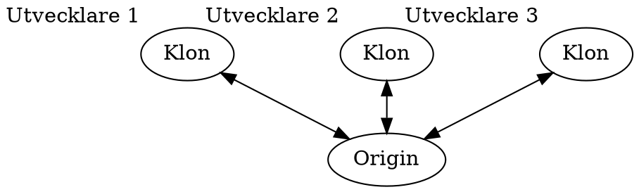

<div class="title-page">

# Programmering i team
</div>

---

<div class="title-page">

## Versionshantering
</div>

---

## Gemensamt kodbas

- Ett team bidrar utvecklare typiskt till en gemensam kodbas i ett repo
- Varje utvecklare arbetar lokalt i en klon av det gemensamma repot
- I klonen är det gemensamma repot en *remote* som heter  ``origin`` 

<div style="zoom: 50%">

<!-- 

-->

</div>

---

## Kloning

- En lokal klon av ett repo kan skapas med Git-kommandot ``clone``

```sh
> git clone <url>
```

---

## Commit

- En *commit* är en ögonblicksbild av katalogerna och filerna i repot
- Varje commit har:
  - En (eller flera) föregående commits
  - Ett meddelande som dokumenterar:
    - Innehåll/syfte med förändringen i kodbasen
    - Författaren till förändringen
  - En identifierare

---

## Identifierare för commit
- I Git är identifierare för en commit en SHA-1 kontrollsumma
- T.ex. ``70460b4b4aece5915caf5c68d12f560a9fe3e4``
- Kan refereras i kortform: ``70460b4``

--- 

## Commit-historik

- Ett repo lagrar en historik över alla commits
- Historiken visas med kommandot ``git log``

<!-- 
```graphviz 
digraph history {
    rankdir=LR
    edge [dir = "back"]
    node [fixedsize=true, width=1]

    commit1 [label = "6b6be8a", xlabel="Initial commit"]
    commit2 [label = "0428486"]
    commit3 [label = "..", style="dashed"]
    commit4 [label = "d7e9249"]
    commit5 [label = "3d3adc5"]
    
    commit1 ->
    commit2 ->
    commit3 ->
    commit4 ->
    commit5
}
-->

--- 

--- 

## Återställning av commit

- En lokalt repo kan återställas till en tidigare commit med Git-kommandot ``checkout``

    ```sh
    > git checkout 0428486
    ```

- Den aktuellt utcheckade commiten har alias ``HEAD``
  
---

## Status på filer i repo

- Filer i ett repo kan ha fyra olika tillstånd

<!-- 

```graphviz
digraph file_status {
    nodesep=0.5
    node [fixedsize=true, width=1]
    untracked 
    staged
    unmodified
    modified

    untracked -> staged [label = "git add"]
    unmodified -> modified [label = "redigering"]
    staged -> unmodified [label = "git commit"]
    modified -> unmodified [label = "git checkout"]
    unmodified -> untracked [label = "git rm"]
    modified -> staged [label = "git add"]
}
```
-->

---

## Lokalt arbetsflöde

- Checka ut utgångs-commit (om inte  HEAD)
- Gör förändringar i filerna
- Arrangera ny commit med ``git add``
- Verställ commit

---

## Branch
