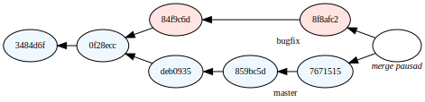
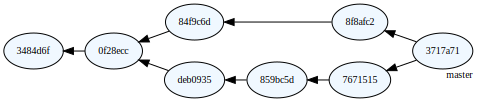
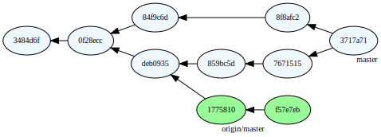
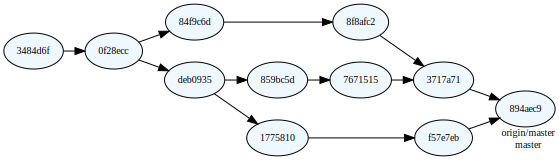

<div class="title-page">

# Programmering i team
</div>

---

<div class="title-page">

## Versionshantering
</div>

---

## Gemensamt kodbas

- Ett team av utvecklare bidrar typiskt till en gemensam kodbas i ett repo
- Varje utvecklare arbetar lokalt i en klon av det gemensamma repot
- I klonen är det gemensamma repot en *remote* som heter  ``origin`` 

<br/>
<div style="display: flex; flex-direction: column; align-items: center; zoom: 150%">


</div>

</div>

---

## Kloning av repo

- En lokal klon av ett repo kan skapas med Git-kommandot ``clone``

```sh
> git clone <url>
```

---

## Commit

- En *commit* är en ögonblicksbild av katalogerna och filerna i repot
- Med varje commit lagras:
  - Ett meddelande som dokumenterar:
    - Innehåll/syfte med förändringen i kodbasen
    - Författaren till förändringen
  - En identifierare
- En commit kan också ha en (eller flera) föregående commits

---

## Identifierare för commit
- I Git är identifierare för en commit en SHA-1 kontrollsumma
- T.ex. ``70460b4b4aece5915caf5c68d12f560a9fe3e4``
- Kan refereras i kortform: ``70460b4``

--- 

## Historik

Ett repo lagrar alla historiska commits och deras relation. 

<br/>
<div style="display: flex; flex-direction: column; align-items: center; zoom: 110%">


</div>

<br/>

--- 

## Återställning av tidigare commit

- Ett lokalt repo kan återställas till en tidigare commit med ``git checkout``:

    ```sh
    > git checkout 0428486
    ```

- Den aktuellt utcheckade commiten har alias ``HEAD``
- Typiskt checkas commits ut via ett branchnamn, t.ex. 

  ```sh
  > git checkout master
  ```
  
- Historiken för utcheckad commit kan visas med kommandot ``git log``
---

## Status på filer i lokalt repo

- Filer i ett repo kan ha fyra olika tillstånd.
- Filer och kataloger som inte har status unmodified listas med: ``git status``


<div style="display: flex; flex-direction: column; align-items: center; zoom: 140%">


</div>

---

## Arbetsflöde

- Checka ut önskad branch
- Redigera filerna
- Arrangera ny commit med ``git add``
- Verkställ commit 

---

## Skapa ny commit 

- En commit görs med ``git commit``
- Utcheckad branch flyttas automatiskt fram till den nya comitten. 

<br/>
<center>
Före commit
</center>
<div style="display: flex; flex-direction: column; align-items: center; zoom: 110%">


</div>
<center>
Efter commit
</center>
<div style="display: flex; flex-direction: column; align-items: center; zoom: 110%">


</div>

---

## Branch

- Från en given commit kan utvecklingen dela upp sig i flera spår
- I Git kallas ett utvecklingsspår för ***branch***
- En branch är ett alias för sista commiten i ett utvecklingsspår

<br/>
<div style="display: flex; flex-direction: column; align-items: center; zoom: 150%">


</div>

---

## Skapa en ny branch 

- För att skapa en ny branch, checka först ut utgångscommiten för branchen
- För att t.ex. skapa en ny branch ``bug-fix`` ge sedan kommandot:

  ```sh
  > git checkout -b bug-fix
  ```
- För att lägga till den nya branchen i en remote, t.ex. ``origin`` används:

  ```sh
  > git push -u origin bug-fix
  ```

---

## Merge

- För att återföra arbetet t.ex. på branchen ``bug-fix`` till ``master`` används:

  ```sh
  > git merge bug-fix
  ```

  i repot med branchen ``master`` utcheckad.
- Skapar en ny commit med alla ändringar från ``bug-fix`` och ``master``

<br/>
<div style="display: flex; flex-direction: column; align-items: center; zoom: 150%">



</div>

--- 

## Konflikter

- Om samma filrader har ändrats i två mergade branscher uppstår en **konflikt**
- Mergen pausas med konfliktmarkörer placeras i berörda filer

```text
<<<<<<< HEAD:file.txt
Hello world
=======
Goodbye
>>>>>>> 77976da:file.txt
```

---

### Konfliktlösning

- Utvecklaren måste manuellt lösa konflikterna
- Texten inom konfliktmarkörerna ersätts med önskat innehåll
- Konfliktmarkörerna avlägsnas
- Kör ``git add`` på filen med konflikt för att markera som löst
- När alla konflikter är lösta kör ``git commit``
- Branchen ``bug-fix``behövs inte länge och kan tas bort med: 

  ```sh 
  git branch -d bug-fix
  ```

---

## Resultat efter merge

<br/>
<div style="display: flex; flex-direction: column; align-items: center; zoom: 150%">



</div>

---

## Lokalt vs. remote

- Git lagrar alla commits, även unika för remotes och i egna repot
- Hämta nya commits och uppdaterade brancher på remote med: ``git fetch``
- En branch kan peka till olika commits lokalt och på remote

<div style="display: flex; flex-direction: column; align-items: center; zoom: 150%">



</div>

---

## Merge med remote

- Lokal ändringar på loak ``master``-branch sammanföras med remote genom:

  ```sh
  > git merge origin/master
  ```

  med den lokala ``master``-branschen utcheckad. 

<div style="display: flex; flex-direction: column; align-items: center; zoom: 150%">


</div>
---

## Ladda upp ändringar till remote

- Nu är vägen från lokal ``master`` till ``origin/master`` utstakad
- Kommandot ``git push`` med ``master`` utcheckad:
  - Laddar upp nya commits till remote
  - Flyttar fram ``origin/master`` till samma commit som ``master``

---

### Efter push

Efter ``git push`` är historiken för branchen identisk lokalt och på remote.

<br/>
<div style="display: flex; flex-direction: column; align-items: center; zoom: 150%">



</div>

 

