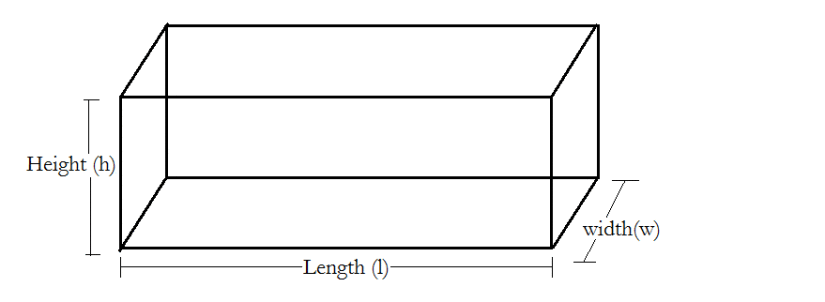

# Klasser och objekt
## Övningar

---

### Övning (1)

#### Fyll i luckorna

- Ett objekt är en instans av en _________.
- Operatorn ``new`` används för att _________ ett objekt, och konstruktorn används för att _________ ett objekt. Båda används i rgel samtidigt.
- En samlingsnamn för egenskaper, variabler och metoder i en klass är _________.
- En egenskap av datatyp ``int`` har defaultvärdet _________.
- En egenskap av datatyp ``bool`` har defaultvärdet _________.
- En egenskap av referenstyp har defaultvärdet _________.
- Garbage Collector tar bort ett objekt från minnet när det inte längre finns en _________ till objektet.

---

### Övning (1)

Inspektera koden nedan (OBS: ``/* ... */`` indikerar att det finns kod där egentligen som vi inte skriver ut här)
```cs
class Dog {
  private float weight;
  public Dog(float weight) { /* ... */ }
  public float Weight { 
      set { /* ... */ }
      get { /* ... */ }
  }
  public static void PrintDogFact() { /* ... */ }
  public void Bark() {
    string barkstring = "Woof!";
    Console.WriteLine(barkstring);
  }
}
```
#### Fyll i luckorna
- ``Dog.Weight`` kallas för ett _________.
- ``Dog(float weight)`` är en _________.
- ``Dog.Weight`` är en _________  med är särskilda metoder  _________ och _________.
- ``Dog.Bark()`` är en _________-metod medan ``Dog.PrintDogFact()`` är en _________-metod.
- För att kunna köra en klass måste klassen ha en _________-metod.
- Vi kan ange medlemmars synliglighet genom _________ såsom ``public`` och ``private``.
- Variabeln ``barkstring`` är inte ett egenskap, utan en _________ variabel.

---

### Övning

#### Sant eller falskt?

- Det kan finnas flera instanser av samma klass i ett program.
- En klass har alltid en metod som kan användas som entry point för körning av applikationen.
- När vi skriver ``string s;`` instantieras ett objekt av typen ``string`` i minnet.
- Vi kan deklarera en klass i en egen fil med samma namn som klassen och filtillägget ``.cs``.
- Max en klass får deklareras i en och samma fil.
- Man kan deklarera en klass som ``private``.
- Vi har alltid tillgång till ``static`` medlemmar i en klass.
- Egenskaper låter oss lagra ett objekts tillstånd.
- Medlemsvariabler låter oss lagra ett objekts tillstånd.
- Lokala variabler måste alltid initialiseras manuellt innan användning, men egenskap initialiseras med standardvärden.

--- 

### Övning (1)



I denna uppgift ska du bygga vidare på följande klass ``Brick`` som representerar ett rätblock (lägg klassen i en fil *Brick.cs*):

```cs
public class Brick {
    private float Height;
    private float Length;
    private float Width;
}
```

a) Skriv en konstruktor till klassen ``Brick`` med parametrar ``float height``, ``float length`` och ``float width``. Den första parametern ska användas för att initialisera  egenskapen ``Height``, den andra för att initialisera egenskapen ``Length`` och den tredje för att initialisera egenskapen ``Width``.

b) Skriv accesormetoder till klassen ``Brick`` för egenskaperna ``Height``, ``Length`` och ``Width``. 

c) Skriv en egenskap ``float Volume`` för volymen av rätblocket som ``Brick``-objekt representerar.

d) Skriv i ``Main``-metoden skriv följande kod och programmet.

```cs
public static void Main(string[] args) {
    float height = 4.0f, length = 2.0f, width = 3.0f; 
    Brick brick = new Brick(height, length, width);
    Console.WriteLine("Volume is: " + brick.Volume;
    brick.Length = 1.0f;
    Console.WriteLine("Brick length is now: " + brick.Length);
    Console.WriteLine("Volume is now: " + brick.Volume);
}

```

Om du utförde uppgift a)-c) korrekt skall koden ge en utskrift i stil med:
```console
Volume is: 24.0
Brick length is now: 1.0
Volume is now: 12.0
```

---

### Övning (2)

När vi pratar om hur en variabel av av värdetyp skapas använder vi begreppen som *definition*, *tilldelning* och *initialisering*. När vi pratar om referenstyper tillkommer ett koncept. Vilket? Vad innebär det?

---

### Övning (1)

För att få längden hos en sträng ``s`` skriver vi ``s.Length``, medan för att få längden i en specifik dimension från ett flerdimensionell fält ``a`` skriver vi t.ex. ``a.GetLengt(0)``.

#### Fyll i luckorna

Från en sträng får vi längden genom en _____ medan från ett flerdimensionellt fält får vi längden genom en _______.

---

### Övning (1)

Inspektera följande klass:
```cs
using System;

public class Program {
  private bool b = true;

  public static void PrintB() {
    Console.WriteLine(b);
  }
}
```
Varför kan vi inte köra programmet?

---

### Övning (1)

Inspektera klassen nedan.
```cs
class Dog {
    private string name;

    public string Name {
        get { return name; }
        set { name = value; }
    }

    public void Bark() {
        Console.WriteLine("Bark!");
    }

    public static void PrintMotto() {
        Console.WriteLine("Dog is man's best friend");
    }

}
```

Vilka av klassens metoder är klassmetoder och vilka är instansmetoder?

---

### Övning (1)

Inspektera koden nedan
```cs
public class Program {
    public static void Main(string[] args) {
        Movie[] movies = { new Movie("Tarzan"), new Movie("Bambi") };
    }
}

class Movie {
    private string title;
    public Movie(string title) {
        this.title = title;
    }
    public string Title => title; 
}
```

Skriv *en kodrad* i ``Main``-metoden som skriver ut titeln på den första filmen i ``Movie``-arrayen ``movies`` till konsolen (att hårdkoda "Tarzan" i koden är inte tillåtet).

---

# Övning (2)

Inspektera koden nedan:

```cs
public class Program {

	public static void Main(string[] args) {
		Thing thing = new Thing(5, 10);
		thing.Summarize();
		ChangeThing(thing, 50, 100);
		thing.Summarize();
	}
	
	public static void ChangeThing(Thing thing, int x, int y) {
        // your code here
	}

}

class Thing {
	
	private int x;
	private int y;
	
	public Thing(int x, int y) {
		this.x = x;
		this.y = y;
	}

	public int X {
        get => x;
        set => x = value;
    }

	public int Y {
        get => y;
        set => y = value;
    }

	public void Summarize() {
		Console.WriteLine("This Thing object has attribute values x="+x+", y="+y);
	}
	
}
```

a) Implementera metoden ``void ChangeThing(Thing thing, int x, int y)`` tillhörande klassen ``Main`` så att körning av programmet resulterar i följande utskrift:
```console
This Thing object with x=5, y=10
This Thing object with x=50, y=100
```

b) Metoder i C# är *pass-by-value* per default dvs. en kopia av argumentet är vad som används lokalt inuti metoden. Förklara varför det är möjligt att ändra vårt ``Thing``-objekt genom en metod trots detta.

---

### Övning (2)

I denna uppgift ska du bygga vidare på följande klass:

```cs
public class Counter {
    private int value; 

    public Counter() {
        value = 0;
    }
    
    public int Value => value;
}
```

a) Ge klassen en metod ``void Next()`` som ökar värdet på egenskapen ``value`` med 1.

b) Överlagra konstruktorn med en ny konstruktor som har en parameter ``int value``. När denna konstruktor används ska egenskapen ``value`` initialiseras till parameterns värde.

c) Skriv ett enkelt program med en ``main``-metod som skapar en instans av ``Counter``, anropar ``Next()`` några gånger och sedan skriver ut värdet på egenskapen ``Value``.

---

### Övning (2)

a) Skriv en klass ``Coin`` med följande egenskaper:
- En publik konstruktor ``Coin()`` utan parametrar
- En instansmetod ``bool Flip()`` som returnerar ``true`` med 50% sannolikhet och ``false`` med 50% sannolikhet.

b) Verifiera att din klass funkar som den ska genom att köra följande kod:
```cs
public class Program {
  public static void Main(string[] args) {
    Coin coin = new Coin();
    int numberOfCoinFlips = 1000000;
    int numberOfHeads = 0;
    for (int i=0; i<numberOfCoinFlips; i++) {
      if (coin.Flip()) numberOfHeads++;
    }
    Console.WriteLine("{100.0*numberOfHeads/numberOfCoinFlips:0.##} of the coin flips were heads!");
  }
}
```
Resultatet ska bli *ungefär* 50%.

---

### Övning (2)

a) Skriv en klass ``WeightedCoin`` med följande egenskaper:
- En publik konstruktor ``Coin(double weight)`` där ``weight`` får vara ett flyttal mellan 0 och 100.
- En instansmetod ``bool Flip()`` som returnerar ``true`` med ``weight``% sannolikhet och ``false`` med ``(100-weight)``% sannolikhet.


b) Verifiera att din klass funkar som den ska genom att köra följande kod:
```cs
public class Program {
  public static void Main(string[] args) {
    WeightedCoin coin = new WeightedCoin(0.75);
    int numberOfCoinFlips = 1000000;
    int numberOfHeads = 0;
    for (int i=0; i<numberOfCoinFlips; i++) {
      if (coin.Flip()) numberOfHeads++;
    }
    Console.WriteLine("{100.0*numberOfHeads/numberOfCoinFlips:0.##} of the coin flips were heads!");
  }
}
```

Resultatet ska bli *ungefär* 75%.

---

### Övning (2)

a) Skriv om klassen ``Coin`` med följande egenskaper:
- En publik konstruktor ``Coint(double weight)`` där ``weight`` får vara ett flyttal mellan 0 och 100.
- En publik konstruktor ``Coin()`` utan parametrar.
- En instansmetod ``bool Flip()`` som returnerar ``true`` med X% sannolikhet och ``false`` med (1-X)% sannolikher.
  - Om objektet skapades genom konstruktorn med parametern ``weight`` ska X vara lika med ``weight``
  - Om objektet skapades genom konstuktorn utan en parameter ska X vara lika med 50.

b) Verifiera att din klass funkar som den ska genom att köra följande kod:
```cs
public class Program {

  public static void Main(string[] args) {
	    Coin coin = new Coin();
	    Coin weightedCoin = new Coin(75.0);
	    RunExperiment(coin);
	    RunExperiment(weightedCoin);
  }
  
  public static void RunExperiment(Coin coin) {
    int numberOfCoinFlips = 1000000;
    int numberOfHeads = 0;
    for (int i=0; i<numberOfCoinFlips; i++) {
      if (coin.Flip()) numberOfHeads++;
    }
    Console.WriteLine("{100.0*numberOfHeads/numberOfCoinFlips:0.##} of the coin flips were heads!");
  }
}
```

Resultatet ska bli *ungefär* 50% för det första myntet och *ungefär* 75% för det andra myntet. 

---

### Övning (2)

Skriv en klass ``Bottle`` med följande egenskaper:
- En privat statisk ``int`` som räknar hur många instanser av ``Bottle`` som har skapats under programmets körtid.
- En publik klassmetod ``HowManyBottles()`` som returnerar en ``int`` som anger hur många instanser av ``Bottle`` som har skapats under programmets körtid.

Koden nedan:
```cs
public class Program {
    class Bottle {
        // your code here
    }

    public static void Main(string[] args) {
        Bottle bottle1 = new Bottle();
        Bottle bottle2 = new Bottle();
        Bottle bottle3 = new Bottle();
        Console.WriteLine(Bottle.HowManyBottles()); // should print 3
        Bottle bottle4 = new Bottle();
        Console.WriteLine(Bottle.HowManyBottles()); // should print 4
    }
}
```

ska skriva ut:

```console
3
4
```

----

### Övning (2)

I denna uppgift ska du bygga vidare på följande klass:

```cs
public class Fighter {

  private string name;
  private float strength;

  public Fighter(string name, float strength) {
    this.name = name;
    this.strength = strength;
  }

  public string Name => name;

  public float Strength => strength;
}
```

a) Skriv en instansmetod ``void Fight(Fighter otherFighter)`` som tar ett ``Fighter``-objekt ``otherFighter`` som argument. Metoden ska göra en konsolutskrift som inkluderar ``Name``-egenskapen för det ``Fighter``-objekt av ``otherFighter`` och instansen från vilken metoden anropas som har störst värde på egenskaperna ``strength``.
T.ex:

```cs
Fighter fighter1  = new Fighter("Floyd Maywether", 8.7f);
Fighter fighter2 = new Fighter("Conor McGregor", 6.9f);
fighter1.Fight(fighter2);
```
ska skriva ut något i stil med: 

```console
Floyd Maywether beat Conor McGregor!
```

---

### Övning (3)

I följande övning ska du bygga vidare på följande klass. Du förväntas ha löst den tidigare övningen:

```cs
public class FighterTournament {

  private Fighter[] fighters;

  public FighterTournament(int numberOfFighters) {
    fighters = new Fighter[numberOfFighters];

    Random rng = new Random();

    for (int iFighter=0; iFighter<numberOfFighters; iFighter++) {
      string name = "Fighter" + iFighter;
      float strength = rng.Next(0, 10);
      fighters[iFighter] = new Fighter(name, strength);
    }

  }

}
```

a) Beskriv med egna ord vad medlemsvariabeln ``fighters`` innehåller.
b) Beskriv med egna ord vad klassens konstruktor åstadkommer givet parameters ``int numberOfFighters``
c) Utöka klassen med en metod ``void SummarizeFighters()`` som skriver ut alla ``Fighter``-objekts ``Name`` och ``Strength`` bredvid varandra. 
d) Utöka klassen med en metod ``void Strongest()`` som skriver ut ``Name`` hos den ``Fighter`` som har störst ``Strength``.
e) Utöka klassen med en metod ``void RandomFight()`` som slumpmässigt väljer två ``Fighter``s ur ``fighters`` och anropar instansmetoden ``Fight()`` från ena ``fighter``-objektet med andra ``Fighter``-objektet som argument. 
f) Verifiera att du har löst uppgifterna korrekt genom att köra följande klass:
```cs
public class Program {
  public static void Main(string[] args) {
    FighterTournament tournament = new FighterTournament(8);
    tournament.SummarizeFighters();
    Console.WriteLine("----------");
    tournament.RandomFight();
    Console.WriteLine("----------");
    tournament.Strongest();
  }
}
```

---

### Övning (2)

a) Skriv en klass ``Dice`` som representerar en sexsidig tärning:
- Klassen ska ha en instansmetod ``public int Roll()`` som slumpmässigt returnerar ett tal mellan 1 och 6

b) Skriv ett program som använder klassen ``Dice`` för att slå en träning 5 gånger och skriv ut resultaten.

---

### Övning (2)

a) Skriv en klass ``DiceMultiSided`` som representerar en tärning med godtyckligt många sidor som användaren väljer vid initialisering:
- Klassen ska ha en konstruktor med parametern ``int numberOfSides``
- Klassen ska ha en instansmetod ``public int Roll()`` som slumpmässigt returnerar ett tal mellan 1 och ``numberOfSides``

b) Skriv ett program som slår en ensidig tärning 5 gånger, en sexsidig tärning 5 gånger och en tiosidig tärning 5 gånger, och skriver ut resultaten.

---

### Övning (2)

a) Skriv en klass ``DiceCup`` som representerar en mugg med flera sexsidiga tärningar:
- Klassen ska ha en konstruktor med parametern ``int numberOfDices``
- Klassen ska ha en instansmetod ``public int Roll()`` som returnerar summan av ``numberOfDices`` tärningskast

Återanvänd klassen ``Dice`` från en tidigare övning

b) Skriv ett program som skapar en ``DiceCup`` med 2 tärningar, rullar dem 10 gånger och skriver ut resultaten.

---

### Övning

Inspektera följande klasser som ligger i varsin egna i fil i olika projekt.
```cs
public class MyClass {
  public MyClass() {
    string str;
    Console.WriteLine(str);
  }
}
```

```cs
public class MyClass {
  string str;
  public MyClass() {
    Console.WriteLine(str);
  }
}
```

a) Varför kompilerar inte ovanstående kod medan nedanstående gör det?
b) Vad skirver nedanstående kod ut? Varför?
