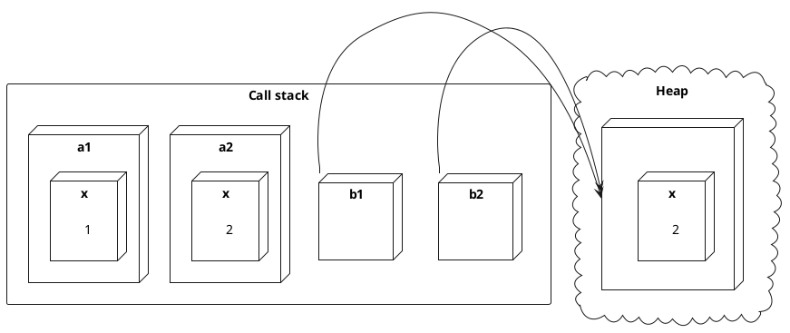

---
presentation:
  width: 1200
  height: 600
  theme: 'serif.css'
  center: false
  slideNumber: true
---
<style type="text/css">
  .reveal h1 {
    display: inline;
    text-align: center;
    display: flex;
    flex-direction: column;
    align-items: center;
  }
  .reveal p {
    text-align: left;
  }
  .reveal ul {
    display: block;
  }
  .reveal ol {
    display: block;
  }
  .reveal section {
    resize: false;
    width: 100%;
    height: 100;
    text-align: left;
   
  }
  .reveal pre {
    zoom: 110%;
  }
  div.slides{
    border: 1px solid black;
  }
  .reveal code {
    zoom: 90%;
  }
</style>


<!-- slide -->

# Klasser och objekt 

<!-- slide -->

## Klasser utökar strukturer

- Både klasser och strukturer är komposittyper
- All syntax för en struktur är giltig för en klass, men.. 
- Strukturer är *värdetyper* och klasser är *referenstyper*

<!-- slide -->

### Exempel

Antag typerna:

```cs
struct A {
    public int x;
}

class B { 
    public int x;
} 
```

<!-- slide -->

Koden nedan: 

```cs
A a1 = new A { x = 1 };
B b1 = new B { x = 1 };
A a2 = a1;
B b2 = b1;
a2.x = 2;
b2.x = 2;
Console.WriteLine($"{a1.x}, {b1.x}, {a1.Equals(a2)}, {b1.Equals(b2)}");
```

ger utskriften: 

```text
1, 2, False, True
```

<!-- slide -->

Skälet framgår ur hur minne allokerats och tilldelats värde av koden, vilket illustreras av figuren nedan:



<!-- slide -->

## Ny möjligheter med klasser

- Konstruerare utan argument. 
- Initialiserare för instansmedlemsvariabler.
- Arv mellan klasser. 

<!-- slide -->

### Exempel

```cs
class A {
    int x = 1; // Ej tillåtet för struktur
    int y;  
    public A() { // Ej tillåtet för struktur
        y = 2;
    }
}
```

<!-- slide -->

## Klasser vs. objekt

- En klass är en typ
- Instanser av en klass kallas *objekt*
- En konstruktor:
  - Anropas med nyckelordet ``new``
  - Skapar och initialiserar ett objekt på heapen
  - Returnerar en referens till objektet

<!-- slide -->

### Exempel

I följande kod:
```cs
class A {
    int x; 
    public A(int x) {
        this.x = x;
    }
}
... 
A a = new A(10);
```
 gäller att ``A`` är en typ och ``a`` är en referens till ett objekt av typen ``A``.

<!-- slide -->

## Vad är objektorienterad programmering?

- Inom procedurell programming beskrivs program genom funktioner, variabler och strukturer
- Inom objektorienterad programmering beskrivs program genom relationer mellan objekt tillhörande klasser

<!-- slide -->

## Objekt

- Ett objekt representeras av:
  - Egenskaper - beskrivande attribut för objektet
    - Färg, form, kodning, namn, rank, etc.
  - Metoder - saker som objektet kan göra
    - Skicka, ta emot, rita, koda, avkoda, .. 

<!-- slide -->

## Klass

- En klass beskriver en delmängd av objekt med gemensamma egenskaper och metoder
- T.ex. för att tillhöra klasssen *Spelkort* så måste objektet ha:
  - En egenskap *Färg* som är *hjärter*, *klöver*, *spader* eller *ruter*
  - Egenskapen *Rank* som är *två*, *tre*, .., *kung* eller *äss*
  - En metod *Rita* för att rendera en grafisk representation av sig själv

<!-- slide -->

## Objektorienterad design

- Objektorienterad design går ut består av att i en systembeskrivning identifiera klasser av objekt och deras  relationer

<!-- slide -->

## Typer av objektrelationer

<div style="display: flex; align-items: center">

<div>

- Har koppling till (*association*)
- Ärver (*inheritance*)
- Implementerar (*implements*)
- Beror på (*dependency*)
- Samlar på (*aggregation*)
- Består av (*composition*)

</div>

<div style="margin-left: 1em; zoom: 1.8">


</div>
</div>

<!-- slide -->

### Exempel

- Poker är ett spel där en *dealer* har en *kortlek* med 52 *spelkort*. 
- Dealern delar turvis ut kort till *spelarna* till dess alla har fem kort på *handen*. 
- Spelare erbjuds en i taget att *kasta* valfritt antal kort och ersätts då med lika många kort av dealern från toppen av leken. 
- Den spelaren som har handen med högst poäng vinner spelet. 
  - Om ingen enskild spelare har en hand med högst poäng delar spelarna med högsta poängen för sin hand på vinsten.  

<!-- slide -->

<table style="zoom: 0.9">
    <tr><th>Hand</th><th>Värde</th></tr>
    <tr><td>Par</td><td>1</td></tr>
    <tr><td>Två par</td><td>2</td></tr>
    <tr><td>Triss</td><td>3</td></tr>
    <tr><td>Stege</td><td>4</td></tr>
    <tr><td>Färg</td><td>5</td></tr>
    <tr><td>Kåk</td><td>6</td></tr>
    <tr><td>Fyrtal</td><td>7</td></tr>
    <tr><td>Färgstege</td><td>8</td></tr>
</table>

