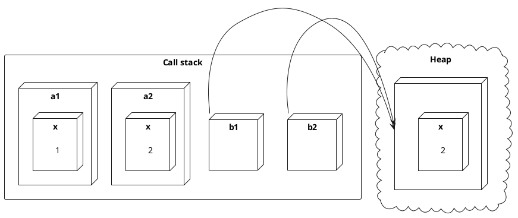
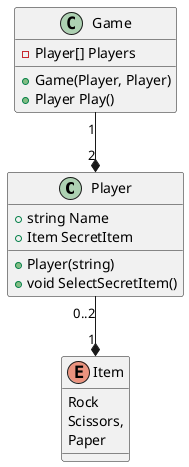

---
presentation:
  width: 1200
  height: 600
  theme: 'serif.css'
  center: false
  slideNumber: true
---
<style type="text/css">
  .reveal h1 {
    display: inline;
    text-align: center;
    display: flex;
    flex-direction: column;
    align-items: center;
  }
  .reveal p {
    text-align: left;
  }
  .reveal ul {
    display: block;
  }
  .reveal ol {
    display: block;
  }
  .reveal section {
    resize: false;
    width: 100%;
    height: 100;
    text-align: left;
   
  }
  .reveal pre {
    zoom: 110%;
  }
  div.slides{
    # border: 1px solid black;
  }
  .reveal code {
    zoom: 90%;
  }
</style>


<!-- slide -->

# Klasser och objekt 

<!-- slide -->

## Klasser utökar strukturer

- Både klasser och strukturer är komposittyper
- All syntax för en struktur är giltig för en klass, men.. 
- Strukturer är *värdetyper* och klasser är *referenstyper*

<!-- slide -->

### Exempel

Antag typerna:

```cs
struct A {
    public int x;
}

class B { 
    public int x;
} 
```

<!-- slide -->

Koden nedan: 

```cs
A a1 = new A { x = 1 };
B b1 = new B { x = 1 };
A a2 = a1;
B b2 = b1;
a2.x = 2;
b2.x = 2;
Console.WriteLine($"{a1.x}, {b1.x}, {a1.Equals(a2)}, {b1.Equals(b2)}");
```

ger utskriften: 

```text
1, 2, False, True
```

<!-- slide -->

Skälet framgår ur hur minne allokerats och tilldelats värde av koden, vilket illustreras av figuren nedan:



<!-- slide -->

## Ny möjligheter med klasser

- Konstruerare utan argument. 
- Initialiserare för instansmedlemsvariabler.
- Arv mellan klasser. 

<!-- slide -->

### Exempel

```cs
class A {
    int x = 1; // Ej tillåtet för struktur
    int y;  
    public A() { // Ej tillåtet för struktur
        y = 2;
    }
}
```

<!-- slide -->

## Klasser vs. objekt

- En klass är en typ
- Instanser av en klass kallas *objekt*
- En konstruktor:
  - Anropas efter nyckelordet ``new``
  - Initialiserar ett nytt objekt på heapen

<!-- slide -->

### Exempel

I följande kod:
```cs
class A {
    int x; 
    public A(int x) {
        this.x = x;
    }
}
... 
A a = new A(10);
```
 gäller att ``A`` är en typ och ``a`` är en referens till ett objekt av typen ``A``.

<!-- slide -->

## Vad är objektorienterad programmering?

- Inom procedurell programming beskrivs program genom funktioner och variabler
- Inom objektorienterad programmering beskrivs program genom *relationer mellan klasser av objekt*

<!-- slide -->

## Objekt

- Ett objekt representeras av:
  - Egenskaper - attribut för objektet
    - Färg, form, kodning, namn, rank, etc.
    - Tilldelas/avläses genom accesssormetoder (``get``/``set``)
  - Metoder - saker som objektet kan göra
    - Skicka, ta emot, rita, koda, avkoda, .. 

<!-- slide -->

## Klass

- En klass beskriver objekt med gemensamma egenskaper och metoder

<!-- slide -->

### Exempel

En *Kortlek* kan definieras som en klass av objekt med: 
  - Egenskapen *Antal kort* som är ett heltal.
  - En *konstruktor* som initerar en ny kortlek med alla 52 kort. 
  - Metoden *Blanda* som slumpar ordningen på korten i leken.
  - En metoden *Ta kort* som ger det översta kortet i leken.
  - En metod *Lägg tillbaka kort* för att föra tillbaka kort till leken.
  

<!-- slide -->

## Objektorienterad design

- Objektorienterad design består av att i en  systembeskrivning identifiera klasser av objekt och deras relationer

<!-- slide -->

## Typer av objektrelationer

<div style="display: flex; align-items: center">

<div>

- Har koppling till (*association*)
- Ärver (*inheritance*)
- Implementerar (*implements*)
- Beror på (*dependency*)
- Samlar på (*aggregation*)
- Består av (*composition*)

</div>

<div style="margin-left: 1em; zoom: 1.8">


</div>
</div>

<!-- slide -->

### Exempel

*Sten, sax, påse* är ett spel med två spelare. Reglerna är att varje spelare i hemlighet väljer *sten*, *sax* och *påse*. Spelarna visar samtidigt sitt föremål åt varandra. Om båda spelarna valt samma föremål så blir det lika och spelet börjar om. Om spelarna valt olika föremål, så vinner en av spelarna enligt logiken:
- Sten krossar sax.
- Sax klipper sönder påse.
- Påse fångar sten.

<!-- slide -->

### Objektorienterad design

<center>



</center>

<!-- slide -->

### Vanliga implementationer av egenskaper

- Inkapsling av privata variabler
- Automatisk implementation
- Härledda egenskaper
- Kortsyntax för ``get``/``set``
- Ännu kortare syntax för egenskaper som bara har ``get``

<!-- slide -->

### Inkapsling av privata variabler

Det är vanligt att värdet för en egenskap lagras i en specifik medlemsvariabel för endamålet. Egenskapen kapslar in medlemsvariabeln och säkerställer att värdet bara kan ändras från utsidan av objektet så som det är meningen. 

```cs
class Person {
    private int age;

    public int Age {
        get { return age; }

        private set {
            if (value >= 0 && value <= 150) { 
                age = value;
            }
        }
    }
}
```

<!-- slide -->

Ibland blir inkapslingen mekanisk, som i exemplet nedan. Då kan en automatisk implementation av egenskapen användas för att göra koden enklare att läsa. 

```cs
class Person {
    private bool driversLicense;

    public bool DriversLicense {
        get { return driversLicense; }

        set { driversLicense = value; }
    }
}
```

<!-- slide -->

### Automatisk implementation

Om kroppen lämnas bort för samtliga accessormetoder genererar kompilatorn automatiskt en osynlig inkapslad medlemsvariabel för egenskapen.

```cs
class Person {
    public bool DriversLicense {
        get;
        set;
    }
}
```

<!-- slide -->

## Härledda egenskaper

En egenskap måste inte kapsla in en specifik medlemsvariabel. Egenskapens värde kan också konstant eller vara härlett från värden på en eller flera medlemsvariabler, som för egenskapen ``Row`` i exemplet nedan.  

```cs
class Array2D {
    private int elements = new int[0];
    private int columns = 0;
    public int Columns {
        get { return columns; }
        set { columns = value; elements = new int[Columns * Rows]; }
    }
    public int Rows {
        get { return elements.Length / Columns; }
        set { elements = new int[value * Columns]; }
    }
}
```

<!-- slide -->

### Kortformssyntax


```cs
class Person {
    private int age;

    public int Age {
        get => age;

        private set {
            if (value >= 0 && value <= 150) { 
                age = value;
            }
        }
    }
}
```

<!-- slide -->

### Ännu kortare syntax

Egenskaper som bara har en ``get``-metod som kan skrivas med lambda-operatorn kan uttryckas ännu mer kompakt:

```cs
class Person {
    private int age;

    public int Age => age; 
}
```
