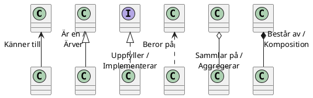

---
presentation:
  width: 1200
  height: 600
  theme: 'serif.css'
  center: false
  slideNumber: true
---
<style type="text/css">
  .reveal h1 {
    display: inline;
    text-align: center;
    display: flex;
    flex-direction: column;
    align-items: center;
  }
  .reveal p {
    text-align: left;
  }
  .reveal ul {
    display: block;
  }
  .reveal ol {
    display: block;
  }
  .reveal section {
    resize: false;
    width: 100%;
    height: 100;
    text-align: left;
   
  }
  .reveal pre {
    zoom: 110%;
  }
  div.slides{
    # border: 1px solid black;
  }
  .reveal code {
    zoom: 90%;
  }
</style>


<!-- slide -->

# Objektorienterad programmering

<!-- slide -->

## Objekt

- Mot omvärden består ett objekt av:
  - Egenskaper - attribut vars värde kan hämtas och/eller sättas
  - Metoder - beskriver vad objektet kan göra 
- Ett objekts innre tillstånd lagras i privata medlemsvariabler
  - Tillståndet kan bara ändras indirekt via egenskaperna/metoderna

<!-- slide -->

## Konstruktor

- En konstruktor är en speciell typ av metod
- Ansvarar för att initiera tillståndet för ett *nytt* objekt

<!-- slide -->

## Klasser

- Klasser beskriver en delmängd objekt med gemensamma egenskaper och metoder
- En klass är också ett objekt med egna egenskaper och metoder.
  - I koden har klassens egna medlemmar modifieraren ``static``


<!-- slide -->

## Objektorienterad design

Identifiera systemets klasser av objekt och deras relationer utgående från en systembeskrivning.

<!-- slide -->

### Olika typer av relationer

<center style="margin-top: 1em; zoom: 1.5">



</center>

<!-- slide -->

### Exempel - Luffarschack

<center>

```plantuml
left to right direction
class Game
{
    - Board Board
    - Player Player1
    - Player Player2
    + Game()
    + void Play()
}

class Player
{
    + Symbol Symbol
    + Player(Symbol)
    + void PlaceSymbol(Board)
}

Game "1" --o "2" Player
Game "1" --o "1" Board

class Board
{
    + Column[] Columns
    + Row[] Rows
    + Diagonal[] Diagonals
    + Symbol operator[int, int]
    + Board()
    + void Draw()
    + bool Full()
    + bool HasCompleteLine()
}

enum Symbol
{
    Blank,
    Cross,
    Cricle
}

class Column 
{
    - Board Board
    - int Index
    + Symbol this[int]
    + bool Complete
    ~ Column(Board, int)
}

class Row 
{
    - Board Board
    - int Index
    + Symbol this[int]
    + bool Complete
    ~ Row(Board, int)
}

enum Direction
{
    DownRigh
    DownLeft
}

class Diagonal 
{
    - Board Board
    - Direction Direction
    + Symbol this[int]
    + bool Complete
    ~ Diagonal(Board, Direction)
}

Board "1" --* "3" Row
Board "1" --* "3" Column
Board "1" --* "2" Diagonal
Row "0..1" --* "3" Symbol
Column "0..1" --* "3" Symbol
Diagonal "0..1" --* "3" Symbol
Diagonal "1" --* "2" Direction
```

</center>

<!-- slide -->

Vi tittar på [koden](https://github.com/jonaskeisu/tictactoe/tree/master/TicTacToeV2).

<!-- slide -->

## Ett problem

- Koden för klasserna ``Row``, ``Column`` och ``Diagonal``har stora likheter.
- Likheterna beror på att objekt av alla tre klasser också är *linjer*. 

<!-- slide -->

### Exempel - Luffarschack (nytt försök)

<center>

```plantuml
left to right direction
class Game
{
    - Board Board
    - Player Player1
    - Player Player2
    + Game()
    + void Play()
}

class Player
{
    + Symbol Symbol
    + Player(Symbol)
    + void PlaceSymbol(Board)
}

Game "1" --o "2" Player
Game "1" --o "1" Board

class Board
{
    + Line[] Lines
    + Symbol operator[int, int]
    + Board()
    + void Draw()
    + bool Full()
    + bool HasCompleteLine()
}

enum Symbol
{
    Blank,
    Cross,
    Cricle
}

abstract Line
{
    - Board Board
    + Symbol this[int]
    + bool Complete
    ~ Line(Board)
    {abstract} # int IndexToBoardRow(int)
    {abstract} # int IndexToBoardColumn(int)

}

class Column
{
    - int Index
    ~ Column(Board, int)
    # int IndexToBoardRow(int)
    # int IndexToBoardColumn(int)

}

class Row 
{
    - int Index
    ~ Row(Board, int)
    # int IndexToBoardRow(int)
    # int IndexToBoardColumn(int)
}

enum Direction
{
    DownRigh
    DownLeft
}

class Diagonal 
{
    - Direction Direction
    ~ Diagonal(Board, Direction)
    # int IndexToBoardRow(int)
    # int IndexToBoardColumn(int)
}

Row --|> Line
Column --|> Line
Diagonal --|> Line


Board "1" --* "3" Row
Board "1" --* "3" Column
Board "1" --* "2" Diagonal

Line "0..1" --* "3" Symbol
Diagonal "1" --* "2" Direction
```

</center>

<!-- slide -->

Vi tittar på den nya [koden](https://github.com/jonaskeisu/tictactoe/tree/master/TicTacToeV3).


<!-- slide -->


## Arv

- Arv tillåter en klass *utöka* en annan klass
- En ärvd klass har alla medlemmar som klassen den ärver från plus egna medlemmar
- Om klassen ``B`` ärver klassen ``A`` så är ``A`` en *bas-* eller *förälderklass* till ``B``
- I C# kan en klass endast direkt ärva en annan klass, men många klasser kan ärva samma klass

<!-- slide -->

## Object

- En klass som inte explicit ärver någon klass ärver automatiskt standardbibliotekets klass ``System.Object``
- Nyckelordet ``object`` är ett alias för ``System.Object``

<!-- slide -->

```cs
class A { // Ärver automatiskt System.Object
    public int a; 
    public void PrintA() => Console.WriteLine($"a = {a}");
}

class B : A { // B ärver A
    public int b; 
    public void PrintB() => Console.WriteLine($"a = {a}, b = {b}");
}
```

<!-- slide -->

Koden nedan:

```cs
static public void Main() {
    A objA = new A() { a = 1 };
    B objB = new B() { a = 2, b = 3 };
    objA.Print();
    objB.Print();
}
```

ger utskriften:

```text
a = 1
a = 2, b = 3
```

<!-- slide -->

## Tilldelning av ärvande typ

- En variabel av typen ``A`` kan tilldelas objekt av vilken typ som helst som antingen är ``A`` eller som ärver från ``A``
- Bara medlemmar som ingår i typen ``A`` kan användas via variabeln, även om den är tilldelad ett objekt av annan typ
- Att en variabel kan tilldelas objekt av olika typer kallas *polymorphism*.

<!-- slide -->

```cs
static public void Main() {
    A obj1 = new B() { a = 2, b = 3 }; // OK, B ärver A
    B obj2 = new A() { a = 1}; // FEL!!! A ärver inte B
    obj1.a = 4; // OK
    obj1.PrintA(); // OK, skriver ut "a = 1"
    obj1.b = 5; // FEL!!! Typen A har ingen variabel b
    obj1.PrintB(); // FEL!!! Typen A har ingen metod PrintB()
}
```

<!-- slide -->

## Exempel

```cs 
class Circle {
    public double Radius { get; set; }
    public double Area => Radius*Radius*Math.PI;
}

enum Color { Red, Green, Blue }

class ColoredCircle : Circle {
    public Color Color { get; set; }
}
```

<!-- slide -->

```cs 
static public void Main(){
    Circle circle = new Circle() { Radius = 1.0 };
    Circle circle2 = new ColoredCircle() { Radius = 1.5, Color = Color.Blue };
    Console.WriteLine(circle.Area); // Skriver ut 3.14
    Console.WriteLine(circle2.Area); // Skriver 7.07
}
```

<!-- slide -->

## Arv i flera led

- Klasser kan ärva i flera led
- Om klassen ``B`` ärver klassen ``A`` så ärver ``B`` också alla klassen som  ``A``  ärver

<!-- slide -->

```cs
class A { // Ärver automatiskt System.Object
    public int a; 
    public void PrintA() => Console.WriteLine($"a = {a}");
}

class B : A { // B ärver A och System.Object
    public int b; 
    public void PrintB() => Console.WriteLine($"a = {a}, b = {b}");
}

class C : B { // C ärver B, A och System.Object
    public int c; 
    public void PrintC() => 
        Console.WriteLine($"a = {a}, b = {b}, c = {c}");
}
```

<!-- slide -->

```cs
static public void Main() {
    A obj1 = new C() { a = 1, b = 2, c = 3 }; // OK, C ärver A via B
    C obj2 = new C() { a = 4, b = 4, c = 6 }; 
    obj1.PrintA(); // OK, skriver ut "a = 1"
    obj2.PrintA(); // OK, skriver ut "a = 4"
    obj2.PrintB(); // OK, skriver ut "a = 4, b = 5"
    obj2.PrintC(); // OK, skriver ut "a = 4, b = 5, c = 6"
}
```

<!-- slide -->

### Exempel 

```cs 
class Circle {
    public double Radius { get; set; }
    public double Area => Radius*Radius*Math.PI;
}
enum Color { Red, Green, Blue }
class ColoredCircle : Circle {
    public Color Color { get; set; }
}
class PositionedColoredCircle : ColoredCircle {
    public double CenterX { get; set; }
    public double CenterY { get; set; }
}
```

<!-- slide -->

Koden nedan: 

```cs 
PositionedColoredCircle circle = new PositionedColoredCircle() { 
    Radius = 1, 
    CenterX = 2.5, 
    CenterY = -5 
};
Console.WriteLine(
    $"Circle with area {circle.Area:0.##}, color {circle.Color} and " + 
    $" position ({circle.CenterX}, {circle.CenterY})");
```

ger utskriften: 

```text 
Circle with area 3.14, color Red and position (2.5, -5)
```

<!-- slide -->

## Casting

- Konvertering av klassreferenser kallas *casting*. 
- Om ``B`` ärver från ``A`` så kan en referens av:
  - Typen ``B`` implicit konverteras till typen ``A``. 
    - Kallas *up-casting*
  - Typen ``A`` explicit konverteras till typen ``B``. 
    - Kallas *down-casting* 
- Downcasting kan misslyckas, genererar då fel.

<!-- slide -->

## Nyckelorden ``as`` och ``is``

- Casting kan också göras med nyckelordet ``as``
  - Resultatet blir ``null`` om castingen misslyckas
- Nyckelordet ``is`` är en operator som kontrollerar om ett refererat objekt ärver från en specifik klass 

<!-- slide -->

## Exempel

```cs
class A { public int a; }
class B : A { public int b; }
class C : B { public int c; }
class D : A { public int d; }
```

<!-- slide -->
```cs 
static public void Main() {
    A obj1 = new A();
    A obj2 = new C(); // OK, implicit casting
    C obj3 = (C)obj2; // OK, explicit casting
    D obj4 = (D)obj2; // OK men genererar fel vid körning!
    if (obj2 is C) { /* Koden här körs */ }
    if (obj2 is D) { /* Koden här körs inte */ }
    C obj4 = obj2 as C; // Implicit casting
    D obj5 = obj2 as D; // obj5 tilldelas null
    if (obj2 is C obj6) {
        // Koden här körs med en lokalt variabel obj6 av typen C
    }
    if (obj2 is C obj7) {
        // Koden här körs inte
    }    
}
```

<!-- slide -->

## Överskuggning av medlemmar

- Om en medlem har modifieraren ``virtual`` så kan ärvande klasser ändra kroppen för medlemmen (men inte medlemmens åtkomst, typ eller signatur)
- Man säger att den ärvande klassens medlem *överskuggar* (*overrides*) basklassens medlem 

<!-- slide -->

```cs
class A {
    virtual public Print() => Console.WriteLine("Hello from A!");
}

class B : A {
    override public Print() => Console.WriteLine("Hello from B!");
}

class C : B {
    override public Print() => Console.WriteLine("Hello from C!");
}
```

<!-- slide -->

Koden nedan:

```cs
A obj1 = new A();
A obj2 = new B();
A obj3 = new C();
obj1.Print();
obj2.Print();
obj3.Print();
```

ger utskriften:

```text
Hello from A!
Hello from B!
Hello from C!
```

<!-- slide -->

## Referns till basklassens medlem

- En klass kan referera medlemmar i basklassen via nyckelordet ``base``

<!-- slide -->

```cs
class A {
    virtual public Print() => Console.WriteLine("Hello from A!");
}

class B : A {
    override public Print() {
        base.Print();
        Console.WriteLine(".. and hello from B!");
    }
}
```

<!-- slide -->

Koden nedan:

```cs
A obj1 = new B();
obj1.Print();
```

ger utskriften:

```text
Hello from A!
.. and hello from B!
```

<!-- slide -->

## Protected

- Åtkomstmodifieraren ``protected`` betyder att en modifierare är synlig för klassens medlemmar och alla ärvande klassers medlemmar

<!-- slide -->

```cs
class A {
    protected int a = 1;
}
class B : A {
    // OK, B ärver A så metoder i B får använda medlemmen a
    override public Print() => Console.WriteLine($"a = {a}");
}
// ..
class Program {
static public void Main() {
    A obj1 = new A();
    B obj2 = new B();
    obj1.a = 2; // FEL!!! Klassen Program ärver inte A
    obj2.a = 2; // FEL!!! Klassen Program ärver inte A
    obj2.Print(); // OK, skriver ut "a = 1"
    // ..
```

<!-- slide -->

## Abstrakta basklasser

- En klass med modifieraren ``abstract`` är *abstrakt* och kan inte instansieras
- En abstrakt klass kan ha abstrakta egenskaper och metoder som då också har modifieraren ``abstract``
- En abstrakt medlem har en signatur men ingen kropp
- En klass som ärvern en (eller flera) abstrakta klasser måste antingen själv också vara abstrakt eller överskugga alla ärvda abstrakta medlemmar 

<!-- slide -->

```cs
abstract class A 
    protected int a = 1;
    abstract public int Value { get; set; }
    abstract public void Modify();
}
class B : A
{
    override public int Value {
        get => a;
        set => a = value;
    }
    override public void Modify() {
        ++a;
    }
}
```

<!-- slide -->

```cs
A obj1 = B(); // OK, B är inte abstrakt och kan instansieras
A obj2 = A(); // FEL!!! A är abstrakt och kan inte instansieras
obj1.Modify();
Console.WriteLine(obj1.Value); // OK, skriver ut "2"
```

<!-- slide -->

## Defaultkonstruktor

- En defaultkonstruktur är en konstruktor som inte tar några argument
- En klass som inte definierar någon konstruktor får en *automatiskt* defaultkonstruktor som initierar alla medlemsvariabler till defaultvärdet för variabelns typ
- Om någon konstruktor definieras i klassen så skapas ingen automatisk defaultkonstruktor

<!-- slide -->

```cs
class A { // Automatisk defaultkonstuktor 
    public int a;
}
class B { // Ingen defaultkonstruktor skapas
    public int b; 

    public B(int value) {
        b = value;
    }
}
class C { // Explicit definierad defaultkonstruktor
    public int c;
    public C() {
        c = 3;
    }
}
```

<!-- slide -->

```cs
A obj1 = A(); // OK
B obj2 = B(); // FEL! B har ingen konstruktor utan argument
C obj3 = C(); // OK
```

<!-- slide -->

## Anrop av basklassens konstruktor

- En klass som ärver en klass utan defaultkonstruktor måste explicit anropa någon konstruktor för basklassen från varje egen konstruktor med nyckelordet ``base``

<!-- slide -->

```cs
class A { // Ingen defaultkonstruktor
    private string a; 
    public A(string text) {
        a = text;
    }
    public void Print() {
        Console.WriteLine(a);
    }
}

class B : A {
    private int b;
    public B(int value, string text) : base(text) {
        b = value;
    }
}
```

<!-- slide -->

```cs
B obj = new B(3, "Hej!");
obj.Print(); // Skriver ut "Hej!"
```

